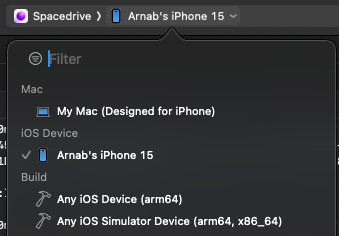
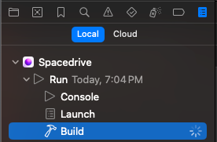

# Welcome to the Spacedrive Contributing Guide

Thank you for investing your time in contributing to our project!

Please read our [Code of Conduct](./CODE_OF_CONDUCT.md) to keep our community approachable and respectable.

This guide will provide an overview of the contribution workflow, including opening an issue, creating a pull request (PR), and the review and merge process.

## New Contributor Guide

To familiarize yourself with the project, please read the [README](README.md). Here are some resources to help you get started with open-source contributions:

- [Finding ways to contribute to open-source on GitHub](https://docs.github.com/en/get-started/exploring-projects-on-github/finding-ways-to-contribute-to-open-source-on-github)
- [Setting up Git](https://docs.github.com/en/get-started/quickstart/set-up-git)
- [GitHub flow](https://docs.github.com/en/get-started/quickstart/github-flow)
- [Collaborating with pull requests](https://docs.github.com/en/github/collaborating-with-pull-requests)
- [Getting started with Tauri](https://tauri.app/v1/guides/getting-started/prerequisites)
- [pnpm CLI](https://pnpm.io/pnpm-cli)

## Getting Started

### Issues

#### Creating a New Issue

If you come across an issue or have a feature request for Spacedrive, please [search if a related issue has already been reported](https://docs.github.com/en/github/searching-for-information-on-github/searching-on-github/searching-issues-and-pull-requests#search-by-the-title-body-or-comments). If no relevant issue exists, you can open a new issue using the appropriate [issue form](https://github.com/spacedriveapp/spacedrive/issues/new/choose).

#### Solving an Issue

To find an issue that interests you, you can browse through our [existing issues](https://github.com/spacedriveapp/spacedrive/issues) and use the available `labels` to narrow down your search (See [Labels](https://github.com/spacedriveapp/spacedrive/labels) for more information). As a general rule, if you find an issue you want to work on, you are welcome to open a PR with a fix.

## Making Changes

### Web-based Clients

This project uses [Cargo](https://doc.rust-lang.org/cargo/getting-started/installation.html) and [pnpm](https://pnpm.io/installation). Make sure you have them installed before proceeding.

To make changes locally, follow these steps:

1. Clone & enter the repository:
   `     git clone https://github.com/spacedriveapp/spacedrive && cd spacedrive
 `
   Alternatively, if you’ve already cloned the repo locally, pull the latest changes with: `git pull`
> [!TIP]
> Consider running `pnpm clean` after pulling the repository if you're returning to it from previously to avoid old files conflicting.
3. Configure your system environment for Spacedrive development

- For Unix users (Linux / macOS), run: `./scripts/setup.sh`
- For Windows users, run: `.\scripts\setup.ps1` via PowerShell.
> [!NOTE]
> This script ([Unix](https://github.com/spacedriveapp/spacedrive/blob/main/scripts/setup.sh) / [Windows](https://github.com/spacedriveapp/spacedrive/blob/main/scripts/setup.ps1)) will check for if Rust and pnpm are installed then proceed to install any other required dependencies for Spacedrive to build via your system's respective package manager.

3. Install NodeJS dependencies: `pnpm i`
4. Prepare the build: `pnpm prep`. This will run all necessary codegen and build required dependencies.

> [!TIP]
> Linux & macOS users can download a bundle of sample files for testing via `pnpm test-data` (requires `curl` & `tar`)
>
> The test files will be located in a directory called `test-data` in the root of the Spacedrive repository.

To run the **desktop** app, run:

```
pnpm tauri dev
```

> [!NOTE]
> The Tauri desktop app always runs its own instance of the backend and will not connect to a separately initiated `sd-server` instance.

To run the **backend server**, run:

```
cargo run -p sd-server
```

> [!TIP]
> If necessary, [DevTools](https://tauri.app/v1/guides/debugging/application/#webview-console) for the WebView can be opened by pressing <kbd>Ctrl</kbd>+<kbd>Shift</kbd>+<kbd>I</kbd> (Linux and Windows) or <kbd>Command</kbd>+<kbd>Option</kbd>+<kbd>I</kbd> (macOS) in the desktop app.
>
> Also, React DevTools can be launched using `pnpx react-devtools`.
> However, it must be executed before starting the desktop app for it to connect.

To run the **web** app (requires the backend to be running), run:

```
pnpm web dev
```

> [!TIP]
> You can also quickly launch the web interface together with the backend with:
>
> ```
> pnpm dev:web
> ```

To run the **e2e tests** for the web app:

```
pnpm web test:e2e
```

If you are developing a new test, you can execute Cypress in interactive mode with:

```
pnpm web test:interactive
```

#### Troubleshooting

- If you encounter any issues, ensure that you are using the following versions of Rust, Node.js and pnpm:
  | tool | version |
  | ---- | ------- |
  | Rust | [`1.81`](rust-toolchain.toml) |
  | Node.js | [`18.18`](.nvmrc) |
  | pnpm | `9.4.0` |

> **Note**: If you get a local migration error in development, you might need to set the following environment variables: [database documentation](docs/developers/architecture/database.mdx#environment-variables).

[`rustup`](https://rustup.rs/) & [`nvm`](https://github.com/nvm-sh/nvm) should both pick up on the appropriate versions of the Rust Toolchain & Node respectively from the project automatically.

- After cleaning out your build artifacts using `pnpm clean`, it's necessary to re-run `pnpm prep`.

- Make sure to read the [guidelines](https://spacedrive.com/docs/developers/prerequisites/guidelines) to ensure that your code follows a similar style to ours.

- After you finish making your changes and committing them to your branch, make sure to execute `pnpm autoformat` to fix any style inconsistency in your code.

### Landing Page

To run the **landing page**, run:

- `pnpm landing dev`

### Mobile App

To run the mobile app:

- Run `./scripts/setup.sh mobile`

#### Android

- Install Java JDK 17 for Android. Java 21 is [not compatible](https://github.com/react-native-async-storage/async-storage/issues/1057#issuecomment-1925963956).
- Install [Android Studio](https://developer.android.com/studio). This will set up most of the dependencies required to build the mobile app.
  - Make sure you have [NDK 26.1.10909125 and CMake](https://developer.android.com/studio/projects/install-ndk#default-version) installed in Android Studio.
- Run `pnpm mobile android` to build the core and begin debugging the app.

> [!TIP]
> To speed up compilation for Android you may temporarily remove unnecessary architectures from the build by removing them from the following line:
> https://github.com/spacedriveapp/spacedrive/blob/d180261ca5a93388486742e8f921e895e9ec26a4/apps/mobile/modules/sd-core/android/build.sh#L61
> Most modern phones use `arm64-v8a` while the Android Studio embedded emulator runs `x86_64`

If you wish to debug directly on a local Android device:

- Install [ADB](https://developer.android.com/tools/adb)
  - On macOS use [homebrew](https://brew.sh/): `brew install adb`
- [Configure debugging on your device](https://developer.android.com/tools/adb#Enabling)
  - Select "Remember this device" & "Trust" when connecting over USB.
- Run `pnpm mobile android` with your device connected via USB.

> [!TIP]
> To access the logs from `sd-core` when running on device, run the following command:
>
> ```
> adb logcat | grep -i com.spacedrive.app
> ```

#### iOS

- Install the latest version of [Xcode](https://apps.apple.com/au/app/xcode/id497799835) and Simulator if you wish to emulate an iOS device on your Mac.
  - When running Xcode for the first time, make sure to select the latest version of iOS.
- Run `pnpm mobile ios` in the terminal to build & run the app on the Simulator.
  - To run the app in debug mode with backend (`sd-core`) logging, comment out the following lines before running the above command:
    https://github.com/spacedriveapp/spacedrive/blob/d180261ca5a93388486742e8f921e895e9ec26a4/apps/mobile/modules/sd-core/ios/build-rust.sh#L51-L54
    You can now get backend (`sd-core`) logs from the Simulator by running the following command:
	  ```
	  xcrun simctl launch --console booted com.spacedrive.app
	  ```
- If you'd like to run the app on device, run: `pnpm mobile ios --device`
> [!IMPORTANT]
> Note that you can only get `sd-core` logs from the app when running it on device by running the frontend and backend separately.

To run the backend (`sd-core`) separately, open up Xcode by running:

```
xed apps/mobile/ios
```

Select from the top if you wish to start on device or Simulator, and press play.

| Select Device                                              | Run the App                                                | Build & Core logs are found here                           |
| ---------------------------------------------------------- | ---------------------------------------------------------- | ---------------------------------------------------------- |
|  |  |  |

To run the frontend, run the following:

```
pnpm mobile start
```

> [!IMPORTANT]
> The frontend is not functional without the sd-core running as well.

### Pull Request

Once you have finished making your changes, create a pull request (PR) to submit them.

- Fill out the "Ready for review" template to help reviewers understand your changes and the purpose of your PR.
- If you are addressing an existing issue, don't forget to [link your PR to the issue](https://docs.github.com/en/issues/tracking-your-work-with-issues/linking-a-pull-request-to-an-issue).
- Enable the checkbox to [allow maintainer edits](https://docs.github.com/en/github/collaborating-with-issues-and-pull-requests/allowing-changes-to-a-pull-request-branch-created-from-a-fork) so that the branch can be updated for merging.
- Once you submit your PR, a team member will review your proposal. They may ask questions or request additional information.
- You may be asked to make changes before the PR can be merged, either through [suggested changes](https://docs.github.com/en/github/collaborating-with-issues-and-pull-requests/incorporating-feedback-in-your-pull-request) or pull request comments. You can apply suggested changes directly through the UI. For other changes, you can make them in your fork and commit them to your branch.
- As you update your PR and apply changes, mark each conversation as [resolved](https://docs.github.com/en/github/collaborating-with-issues-and-pull-requests/commenting-on-a-pull-request#resolving-conversations).
- If you run into any merge issues, refer to this [git tutorial](https://lab.github.com/githubtraining/managing-merge-conflicts) to help you resolve merge conflicts and other issues.

### Your PR is Merged!

Congratulations! 🎉🎉 The Spacedrive team thanks you for your contribution! ✨

Once your PR is merged, your changes will be included in the next release of the application.

### Common Errors

#### `xcrun: error: unable to find utility "xctest", not a developer tool or in PATH`

This error occurs when Xcode is not installed or when the Xcode command line tools are not in your `PATH`.

To resolve this issue:

- Install Xcode from the macOS App Store or directly from [here](https://xcodereleases.com/) (requires Apple Account).
- Run `xcode-select -s /Applications/Xcode.app/Contents/Developer`.
  This command will use Xcode's developer tools instead of macOS's default tools.

#### `unable to lookup item 'PlatformPath'`

If you run into this issue, or similar:

```
error: terminated(1): /us/bin/xcrun --sdk macos --show-sdk-platform-path output :
xcrun: error: unable to lookup item 'PlatformPath' from command line tools installation xcrun: error: unable to lookup item 'PlatformPath' in SDK '/Library/Developer /CommandLineTools/SDKs/MacOSX.sdk'
```

Ensure that macOS is fully updated, and that you have Xcode installed (via the app store).

Once that has completed, run `xcode-select --install` in the terminal to install the command line tools. If they are already installed, ensure that you update macOS to the latest version available.

Also ensure that Rosetta is installed, as a few of our dependencies require it. You can install Rosetta with `softwareupdate --install-rosetta --agree-to-license`.

### Translations

Check out the [i18n README](interface/locales/README.md) for more information on how to contribute to translations.

### Credits

This CONTRIBUTING.md file was inspired by the [github/docs CONTRIBUTING.md](https://github.com/github/docs/blob/main/.github/CONTRIBUTING.md) file, and we extend our gratitude to the original author.
