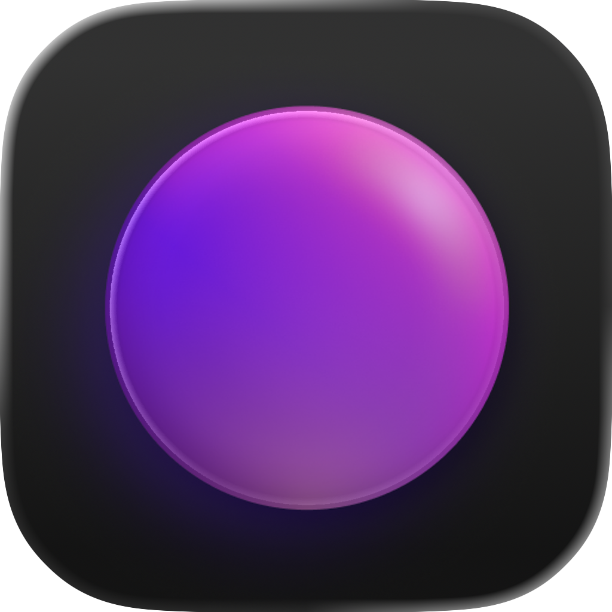

<p align="center">
  
  <h1 align="center">Spacedrive</h1>
  <p align="center">
  	A file manager built on a virtual distributed filesystem
    <br />
    <a href="https://spacedrive.com"><strong>spacedrive.com</strong></a>
    ·
    <a href="https://v2.spacedrive.com"><strong>v2 Documentation</strong></a>
    ·
    <a href="https://discord.gg/gTaF2Z44f5"><strong>Discord</strong></a>
  </p>
  <p align="center">
    <a href="https://discord.gg/gTaF2Z44f5">
      
    </a>
    <a href="https://www.gnu.org/licenses/agpl-3.0">
      
    </a>
    <a href="https://github.com/spacedriveapp/spacedrive">
      
    </a>
    <a href="https://github.com/spacedriveapp/spacedrive/tree/main/extensions">
      
    </a>
  </p>
</p>

Spacedrive is an open source cross-platform file manager, powered by a virtual distributed filesystem (VDFS) written in Rust.

Organize files across multiple devices, clouds, and platforms from a single interface. Tag once, access everywhere. Never lose track of where your files are.

> [!IMPORTANT]
> Hi, Jamie here! This is Spacedrive v2 (December 2025)—a complete ground-up rewrite.
>
> After development of the original alpha version stopped in January this year, left with the hard lessons of the incomplete alpha, I set out to completely rebuild Spacedrive from the ground up. The first release **2.0.0-pre.1** is coming before Christmas.
>
> For now I am open sourcing the code, with complete history from my private fork intact for early testing and preparation for an actual release.
>
> If you're looking for the previous version, see the [v1 branch](https://github.com/spacedriveapp/spacedrive/tree/v1).

## The Problem

Computing was designed for a single-device world. The file managers we use today—Finder, Explorer, Files—were built when your data lived in one place: the computer in front of you.

The shift to multi-device computing forced us into cloud ecosystems. Want your files everywhere? Upload them to someone else's servers. The convenience came at a cost: **data ownership**. This wasn't accidental—centralization was the path of least resistance for solving multi-device sync.

Now AI is accelerating this trend. Cloud services offer intelligent file analysis and semantic search, but only if you upload your data to their infrastructure. As we generate more data and AI becomes more capable, we're giving away more and more to access basic computing conveniences.

**The current system isn't built for a world where:**
- You own multiple devices with underutilized compute and storage
- Local AI models are becoming competitive with cloud alternatives
- Privacy and data sovereignty matter
- You shouldn't have to choose between convenience and control

## The Vision

Spacedrive is infrastructure for the next era of computing. It's an architecture designed for multi-device environments from the ground up—not cloud services retrofitted with offline support, but local-first sync that scales to the cloud when you want it.

As local AI models improve, Spacedrive becomes the fabric that enables the same insights cloud services offer today, but running on hardware you already own, on data that never leaves your control. This is a long-term project correcting computing's trajectory toward centralization.

The file explorer interface is deliberate. Everyone understands it. It's seen the least innovation in decades. And it has the most potential when you bake distributed computing, content awareness, and local AI into something universally familiar.

## How It Works

Spacedrive treats files as **first-class objects with content identity**, not paths. A photo on your laptop and the same photo on your NAS are recognized as one piece of content. This enables:

- **Content-aware deduplication** - Track redundancy across all devices
- **Semantic search** - Find files in under 100ms across millions of entries
- **Transactional operations** - Preview conflicts, space savings, and outcomes before execution
- **Peer-to-peer sync** - No servers, no consensus protocols, no single point of failure
- **Offline-first** - Full functionality without internet, syncs when devices reconnect

Files stay where they are. Spacedrive just makes them universally addressable with rich metadata and cross-device intelligence.

---

## Architecture

Spacedrive is built on four core principles:

### 1. Virtual Distributed Filesystem (VDFS)

Files and folders become first-class objects with rich metadata, independent of their physical location. Every file gets a universal address (`SdPath`) that works across devices. Content-aware addressing means you can reference files by what they contain, not just where they live.

### 2. Content Identity System

Adaptive hashing (BLAKE3 with strategic sampling for large files) creates a unique fingerprint for every piece of content. This enables:

- **Deduplication**: Recognize identical files across devices
- **Redundancy tracking**: Know where your backups are
- **Content-based operations**: "Copy this file from wherever it's available"

### 3. Transactional Actions

Every file operation can be previewed before execution. See exactly what will happen—space savings, conflicts, estimated time—then approve or cancel. Operations become durable jobs that survive network interruptions and device restarts.

### 4. Leaderless Sync

Peer-to-peer synchronization without central coordinators. Device-specific data (your filesystem index) uses state replication. Shared metadata (tags, ratings) uses a lightweight HLC-ordered log with deterministic conflict resolution. No leader election, no single point of failure.

---

## Core Features

| Feature                 | Description                                                                  |
| ----------------------- | ---------------------------------------------------------------------------- |
| **Cross-Platform**      | macOS, Windows, Linux, iOS, Android                                          |
| **Multi-Device Index**  | Unified view of files across all your devices                                |
| **Content Addressing**  | Find optimal file copies automatically (local-first, then LAN, then cloud)   |
| **Smart Deduplication** | Identify identical files regardless of name or location                      |
| **Cloud Integration**   | Index S3, Google Drive, Dropbox as first-class volumes                       |
| **P2P Networking**      | Direct device connections with automatic NAT traversal (Iroh + QUIC)         |
| **Semantic Tags**       | Graph-based tagging with hierarchies, aliases, and contextual disambiguation |
| **Action Preview**      | Simulate any operation before execution                                      |
| **Offline-First**       | Full functionality without internet, syncs when devices reconnect            |
| **Local Backup**        | P2P backup between your own devices (iOS photo backup available now)         |
| **Extension System**    | WASM-based plugins for domain-specific functionality                         |

---

## Tech Stack

**Core**

- **Rust** - Entire VDFS implementation (~183k lines)
- **SQLite + SeaORM** - Local-first database with type-safe queries
- **Iroh** - P2P networking with QUIC transport and hole-punching
- **BLAKE3** - Fast cryptographic hashing for content identity
- **WASM** - Sandboxed extension runtime

**Apps**

- **CLI** - Command-line interface
- **Server** - Headless daemon for Docker deployment
- **Tauri** - Cross-platform desktop (macOS, Windows, Linux) with React frontend
- **Web** - Web interface and shared UI components
- **Mobile** - Cross-platform mobile React Native mobile app (coming soon)
- **Prototypes** - Native Swift apps (iOS, macOS) and GPUI media viewer for exploration

**Architecture Patterns**

- Event-driven design with centralized EventBus
- CQRS: Actions (mutations) and Queries (reads) with preview-commit-verify
- Durable jobs with MessagePack serialization
- Domain-separated sync with clear data ownership boundaries

---

## Project Structure

```
spacedrive/
├── core/              # Rust VDFS implementation
│   ├── src/
│   │   ├── domain/    # Core models (Entry, Library, Device, Tag)
│   │   ├── ops/       # CQRS operations (actions & queries)
│   │   ├── infra/     # Infrastructure (DB, events, jobs, sync)
│   │   ├── service/   # High-level services (network, file sharing)
│   │   ├── location/  # Location management and indexing
│   │   ├── library/   # Library lifecycle and operations
│   │   └── volume/    # Volume detection and fingerprinting
├── apps/
│   ├── cli/           # CLI for managing libraries and running daemon
│   ├── server/        # Headless server daemon
│   ├── tauri/         # Cross-platform desktop app (macOS, Windows, Linux)
│   ├── ios/           # Native prototype (private)
│   ├── macos/         # Native prototype (private)
│   └── gpui-photo-grid/  # GPUI media viewer prototype
├── extensions/        # WASM extensions
├── crates/            # Shared Rust utilities
└── docs/              # Architecture documentation
```

---

## Extensions

Spacedrive's WASM-based extension system enables specialized functionality while maintaining security and portability.

Note: This is a heavy WIP, but will be complete in the first 2.0.0-pre.1 release.

### Professional Extensions

| Extension     | Purpose                         | Key Features                                                                | Status      |
| ------------- | ------------------------------- | --------------------------------------------------------------------------- | ----------- |
| **Photos**    | AI-powered photo management     | Face recognition, place identification, moments, scene classification       | In Progress |
| **Chronicle** | Research & knowledge management | Document analysis, knowledge graphs, AI summaries                           | In Progress |
| **Atlas**     | Dynamic CRM & team knowledge    | Runtime schemas, contact tracking, deal pipelines                           | In Progress |
| **Studio**    | Digital asset management        | Scene detection, transcription, proxy generation                            | Planned     |
| **Ledger**    | Financial intelligence          | Receipt OCR, expense tracking, tax preparation                              | Planned     |
| **Guardian**  | Backup & redundancy monitoring  | Content identity tracking, zero-redundancy alerts, smart backup suggestions | Planned     |
| **Cipher**    | Security & encryption           | Password manager, file encryption, breach alerts                            | Planned     |

### Open Source Archive Extensions

| Extension           | Purpose                 | Provides Data For        | Status  |
| ------------------- | ----------------------- | ------------------------ | ------- |
| **Email Archive**   | Gmail/Outlook backup    | Atlas, Ledger, Chronicle | Planned |
| **Chrome History**  | Browsing history backup | Chronicle                | Planned |
| **Spotify Archive** | Listening history       | Analytics                | Planned |
| **GPS Tracker**     | Location timeline       | Photos, Analytics        | Planned |
| **Tweet Archive**   | Twitter backup          | Chronicle, Analytics     | Planned |
| **GitHub Tracker**  | Repository tracking     | Chronicle                | Planned |

---

## Getting Started

### Prerequisites

- **Rust** 1.81+ ([rustup](https://rustup.rs/))
- **Bun** 1.3+ ([bun.sh](https://bun.sh)) - For Tauri desktop app

### Quick Start with Desktop App (Tauri)

Spacedrive runs as a daemon (`sd-daemon`) that manages your libraries and P2P connections. The Tauri desktop app can launch its own daemon instance, or connect to a daemon started by the CLI.

```bash
# Clone the repository
git clone https://github.com/spacedriveapp/spacedrive
cd spacedrive

# Install dependencies
bun install
cargo run -p xtask -- setup  # generates .cargo/config.toml with aliases
cargo build # builds all core and apps (including the daemon and cli)

# Copy dependencies into the debug Folder ( probably windows only )
Copy-Item -Path "apps\.deps\lib\*.dll" -Destination "target\debug" -ErrorAction SilentlyContinue
Copy-Item -Path "apps\.deps\bin\*.dll" -Destination "target\debug" -ErrorAction SilentlyContinue

# Run the desktop app (automatically starts daemon)
cd apps/tauri
bun run tauri:dev
```

### Quick Start with CLI

The CLI can manage libraries and run a persistent daemon that other apps connect to:

```bash
# Build and run the CLI
cargo run -p sd-cli -- --help

# Start the daemon (runs in background)
cargo run -p sd-cli -- daemon start

# Create a library
cargo run -p sd-cli -- library create "My Library"

# Add a location to index
cargo run -p sd-cli -- location add ~/Documents

# Search indexed files
cargo run -p sd-cli -- search .

# Now launch Tauri app - it will connect to the running daemon
```

### Native Prototypes

Experimental native apps are available in `apps/ios/`, `apps/macos/`, and `apps/gpui-photo-grid/` but are not documented for public use. These prototypes explore platform-specific optimizations and alternative UI approaches.

### Running Tests

Spacedrive has a comprehensive test suite covering single-device operations and multi-device networking scenarios.

```bash
# Run all tests
cargo test --workspace

# Run specific test
cargo test test_device_pairing --nocapture

# Run with detailed logging
RUST_LOG=debug cargo test test_name --nocapture

# Run core tests only
cargo test -p sd-core
```

See the [Testing Guide](https://v2.spacedrive.com/core/testing) for detailed documentation on:

- Integration test framework
- Multi-device subprocess testing
- Event monitoring patterns
- Test helpers and utilities

All integration tests are in `core/tests/` including device pairing, sync, file transfer, and job execution tests.

### Development Commands

```bash
# Run all tests
cargo test

# Run tests for specific package
cargo test -p sd-core

# Build CLI in release mode
cargo build -p sd-cli --release

# Format code
cargo fmt

# Run lints
cargo clippy
```

---

## Privacy & Security

Spacedrive is **local-first**. Your data stays on your devices.

- **End-to-End Encryption**: All P2P traffic encrypted via QUIC/TLS
- **At-Rest Encryption**: Libraries can be encrypted on disk (SQLCipher)
- **No Telemetry**: Zero tracking or analytics in the open source version
- **Self-Hostable**: Run your own relay servers and cloud cores
- **Data Sovereignty**: You control where your data lives

Optional cloud integration (Spacedrive Cloud) is available for backup and remote access, but it's never required. The cloud service runs unmodified Spacedrive core as a standard P2P device—no special privileges, no custom APIs.

---

## Documentation

- **[v2 Documentation](https://v2.spacedrive.com)** - Complete guides and API reference
- **[Whitepaper](whitepaper/spacedrive.pdf)** - Technical architecture (work in progress)
- **[Contributing Guide](CONTRIBUTING.md)** - How to contribute
- **[Architecture Docs](docs/core/architecture.md)** - Detailed system design
- **[Extension SDK](docs/sdk.md)** - Build your own extensions

---

## Get Involved

- **Star the repo** to support the project
- **Join [Discord](https://discord.gg/gTaF2Z44f5)** to chat with developers and community
- **Read the [v2 Documentation](https://v2.spacedrive.com)** for guides and API reference
- **Read the [Whitepaper](whitepaper/spacedrive.pdf)** for the full technical vision
- **Build an Extension** - Check out the [SDK docs](docs/sdk.md)
