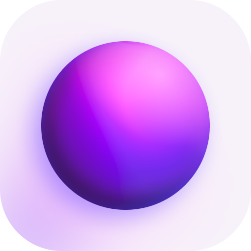
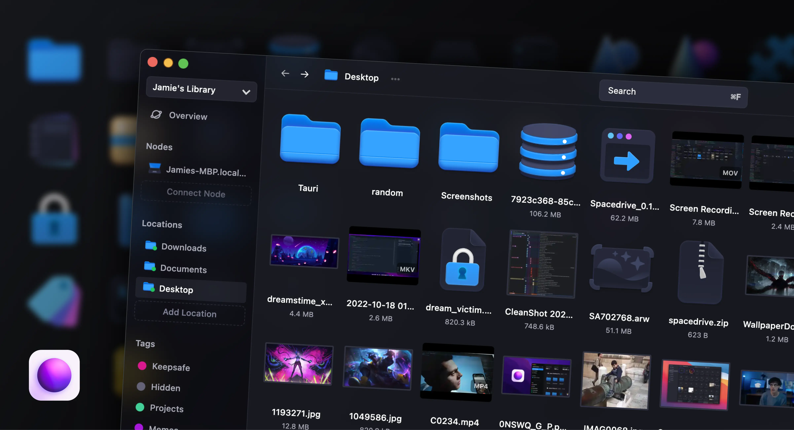

  

   
  

	<h1 align="center"><b>Spacedrive</b></h1>
	

		A file explorer from the future.
     
    <a href="https://spacedrive.com"><strong>spacedrive.com »</strong></a>
     
     
    <b>Download for </b>
    macOS (<a href="https://www.spacedrive.com/api/releases/desktop/stable/darwin/aarch64">Apple Silicon</a> |
    <a href="https://www.spacedrive.com/api/releases/desktop/stable/darwin/x86_64">Intel</a>) ·
		<a href="https://www.spacedrive.com/api/releases/desktop/stable/windows/x86_64">Windows</a> ·
		<a href="https://www.spacedrive.com/api/releases/desktop/stable/linux/x86_64">Linux</a> ·
		iOS ·
		Android
     
    <i>~ Links for iOS & Android will be added once a release is available. ~</i>
  

Spacedrive is an open source cross-platform file manager, powered by a virtual distributed filesystem (<a href="#what-is-a-vdfs">VDFS</a>) written in Rust.
 
 

> UPDATE: Spacedrive moving into beta with v0.5 (coming November 2024). Some major features are currently only accessible via feature flags.

Organize files across many devices in one place. From cloud services to offline hard drives, Spacedrive combines the storage capacity and processing power of your devices into one personal distributed cloud, that is both secure and intuitive to use.

For independent creatives, hoarders and those that want to own their digital footprint, Spacedrive provides a free file management experience like no other.

  
   
   
  
  
  
  
  
  
   

# What is a VDFS?

A VDFS (virtual distributed filesystem) is a filesystem designed to work across a variety of storage layers. With a uniform API to manipulate and access content across many devices, VDFS is not restricted to a single machine. It achieves this by maintaining a virtual index of all storage locations, synchronizing the database between clients in realtime. This implementation also uses [CAS](https://en.wikipedia.org/wiki/Content-addressable_storage) (Content-addressable storage) to uniquely identify files, while keeping record of logical file paths relative to the storage locations.

The first implementation of a VDFS can be found in this UC Berkeley [paper](https://www2.eecs.berkeley.edu/Pubs/TechRpts/2018/EECS-2018-29.pdf) by Haoyuan Li. This paper describes its use for cloud computing, however the underlying concepts can be translated to open consumer software.

# Motivation

Many of us have multiple cloud accounts, drives that aren’t backed up and data at risk of loss. We depend on cloud services like Google Photos and iCloud, but are locked in with limited capacity and almost zero interoperability between services and operating systems. Photo albums shouldn’t be stuck in a device ecosystem, or harvested for advertising data. They should be OS agnostic, permanent and personally owned. Data we create is our legacy, that will long outlive us—open source technology is the only way to ensure we retain absolute control over the data that defines our lives, at unlimited scale.

# Roadmap

View a list of our planned features here: [spacedrive.com/roadmap](https://spacedrive.com/roadmap)

# Developer Guide

Please refer to the [contributing guide](CONTRIBUTING.md) for how to install Spacedrive from sources.

# Security Policy

Please refer to the [security policy](SECURITY.md) for details and information on how to responsibly report a security vulnerability or issue.

# Architecture

This project is using what I'm calling the **"PRRTT"** stack (Prisma, Rust, React, TypeScript, Tauri).

- Prisma on the front-end? 🤯 Made possible thanks to [prisma-client-rust](https://github.com/brendonovich/prisma-client-rust), developed by [Brendonovich](https://github.com/brendonovich). Gives us access to the powerful migration CLI in development, along with the Prisma syntax for our schema. The application bundles with the Prisma query engine and codegen for a beautiful Rust API. Our lightweight migration runner is custom built for a desktop app context.
- Tauri allows us to create a pure Rust native OS webview, without the overhead of your average Electron app. This brings the bundle size and average memory usage down dramatically. It also contributes to a more native feel, especially on macOS due to Safari's close integration with the OS.
- We also use [rspc](https://rspc.dev), created by Oscar Beaumont, which allows us to define functions in Rust and call them on the TypeScript frontend in a completely typesafe manner.
- The core (`sdcore`) is written in pure Rust.

## Monorepo structure:

### Apps:

- `desktop`: A [Tauri](https://tauri.app) app.
- `mobile`: A [React Native](https://reactnative.dev/) app.
- `web`: A [React](https://reactjs.org) webapp.
- `landing`: A [React](https://reactjs.org) app using [Next.js](https://nextjs.org).
- `server`: A [Rust](https://www.rust-lang.org) server for the webapp.
- `cli`: A [Rust](https://www.rust-lang.org) command line interface. (planned)
- `storybook`: A [React](https://reactjs.org) storybook for the UI components.

### Core:

- `core`: The [Rust](https://www.rust-lang.org) core, referred to internally as `sdcore`. Contains filesystem, database and networking logic. Can be deployed in a variety of host applications.
- `crates`: Shared Rust libraries used by the core and other Rust applications.

### Interface:

- `interface`: The complete user interface in React (used by apps `desktop`, `web`)

### Packages:

- `assets`: Shared assets (images, fonts, etc).
- `client`: A [TypeScript](https://www.typescriptlang.org/) client library to handle dataflow via RPC between UI and the Rust core.
- `config`: `eslint` configurations (includes `eslint-config-next`, `eslint-config-prettier` and all `tsconfig.json` configs used throughout the monorepo).
- `ui`: A [React](https://reactjs.org) Shared component library.

- `macos`: A [Swift](https://developer.apple.com/swift/) Native binary for MacOS system extensions (planned).
- `ios`: A [Swift](https://developer.apple.com/swift/) Native binary (planned).
- `windows`: A [C#](https://docs.microsoft.com/en-us/dotnet/csharp/) Native binary (planned).
- `android`: A [Kotlin](https://kotlinlang.org/) Native binary (planned).
