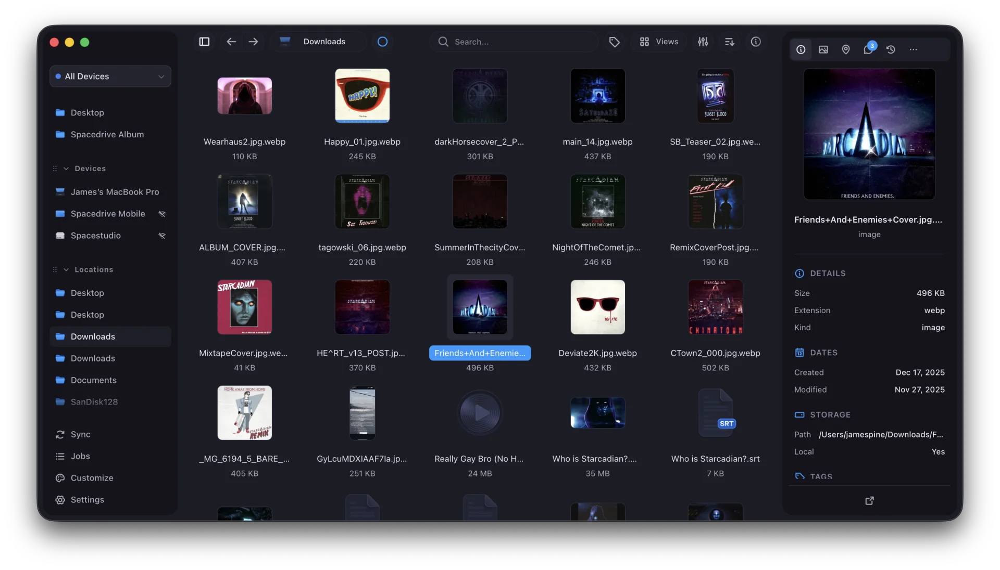
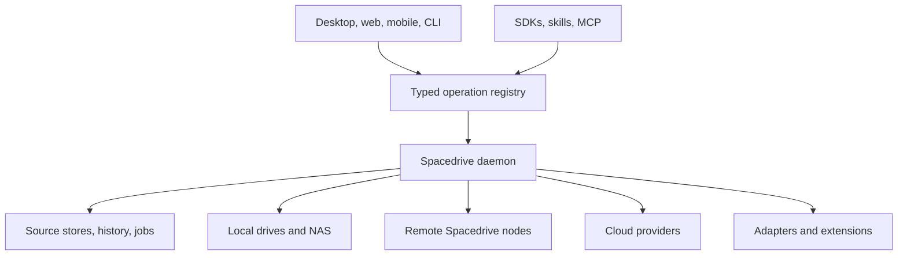

<p align="center">
  
</p>

<h1 align="center">Spacedrive</h1>

<p align="center">
  <strong>Your data should not have to live on somebody else's computer to be useful.</strong>
</p>

<p align="center">
  <a href="https://www.apache.org/licenses/LICENSE-2.0">
    
  </a>
  <a href="https://github.com/spacedriveapp/spacedrive">
    
  </a>
  <a href="https://discord.gg/gTaF2Z44f5">
    
  </a>
</p>

<p align="center">
  <a href="https://github.com/spacedriveapp/spacedrive/releases"><strong>Download</strong></a> &bull;
  <a href="https://docs.spacedrive.com">Docs</a> &bull;
  <a href="https://discord.gg/gTaF2Z44f5">Discord</a> &bull;
  <a href="#build-from-source">Build from source</a>
</p>

---

> [!IMPORTANT]
> **Spacedrive 2.0 arrives October 1, 2026.**
>
> The new release makes self-owned storage practical across your devices. It
> brings portable source indexes, private remote access, mounts, history,
> extensions, and one API for people and software.
> [Download Spacedrive 2.0](https://github.com/spacedriveapp/spacedrive/releases).

Spacedrive is open personal data infrastructure. It turns the storage you
control into one private filesystem across your devices, drives, servers, and
the clouds you choose.

Bring your data home without giving up search, protection, intelligence,
sharing, or access from anywhere. Spacedrive requires no hosted account,
vendor-controlled control plane, or telemetry.

<p align="center">
  
</p>

## Own where your data lives

Cloud services made custody feel like the price of convenience. Personal files
and behavioral data became concentrated on infrastructure whose security,
policies, and future remain outside your control. Automated attacks increase
the scale of that exposure. AI increases the value of accumulated data for
training, inference, and profiling.

A hard drive at home is only part of the answer. You still need to find files,
reach them from another device, understand what is backed up, recover earlier
states, share selected data, and know when something changed.

Spacedrive provides those capabilities while you decide where the bytes and
metadata live. Local disks, removable media, NAS datasets, private servers, and
offline archives are first-class homes. Cloud services remain optional sources
and destinations.

Read the [Product Direction](docs/core/product-direction.mdx) for the complete
product boundary.

## One filesystem, every source

A source can be a folder, a complete drive, a dataset on your NAS, another
Spacedrive node, a cloud bucket, or an external service. Every source uses the
same record shape and the same operations.

Each source has a portable store with two kinds of knowledge: a generation
that can be refreshed while the origin is available, and durable assertions
that cannot be reconstructed from the files alone. Disconnect a drive and its
catalog remains searchable. Move a source to another machine and its metadata
can travel with it.

- **A live index.** Watchers keep names, sizes, timestamps, ownership, links,
  and content state current without walking the filesystem when you open a
  folder.
- **Search across boundaries.** FTS5 routes queries across local, remote, cloud,
  and adapter sources through one interface.
- **Stable identity.** Records survive moves. BLAKE3 content identities connect
  copies of the same bytes across sources and devices.
- **Honest duplicate detection.** Sampled hashes find candidates. Full-byte
  verification confirms equality before destructive cleanup.
- **History that stays useful.** Freeze a source at a point in time, browse an
  offline snapshot, and inspect which operation changed it.
- **Provider exit.** Move data away from a service without losing the
  organization, tags, history, and knowledge built around it.

## Protection is part of the filesystem

Spacedrive treats data hygiene as a core filesystem responsibility.

- Track integrity, redundancy, backup state, capacity, and unexpected changes.
- Distinguish independent copies using physical drives, pools, and failure
  domains.
- Keep an inventory of drives that are offline, archived, lost, or retired.
- Preserve unreadable records with their error instead of silently omitting
  them.
- Run indexing, metadata extraction, previews, and search on infrastructure you
  control by default.
- Identify every external recipient before sending file content or derived
  metadata away from your devices.

An index snapshot preserves evidence about the filesystem. Provider versions
and backups preserve the bytes. Spacedrive connects the two so you can
understand what existed, where it lived, and how to recover it.

## Access anything from anywhere

Pair Spacedrive nodes to browse and operate their authorized sources through
the same interface. A live node serves queries, snapshots, byte ranges, jobs,
and logs. Other nodes can cache projections and content without claiming
authority over the source.

Share a source or subtree with another person, device, or agent without merging
libraries. The host decides what the recipient can see and do. The grant stays
visible and revocable, while the recipient sees the shared data beside their
own sources.

Mount any source or subtree into macOS, Windows, or Linux. Files stream on
demand from a local disk, another device, or a cloud provider through one byte
plane. Range reads power mounts, transfers, previews, media playback, and video
scrubbing without copying the whole file first.

Peer connections use Iroh and QUIC with end-to-end encryption. Devices connect
directly when possible and use relays when network conditions require them.

## One API for people and software

The desktop app, web interface, mobile clients, CLI, generated SDKs, skills, and
MCP server all call the same registered operations. A copy has the same input,
progress, conflicts, and result whether a person clicks it or software invokes
it.

- Operations return structured data and stable identifiers.
- Risky changes support preview, commit, and verification.
- Long-running work becomes a durable job with progress, cancellation, restart
  recovery, and logs.
- Remote clients can inspect the same job state through an authorized session.
- Capabilities are explicit, scoped, visible, and revocable.

Spacedrive does not bundle an agent or choose a model for you. Use the CLI,
skill, SDK, or MCP server with the agent you trust. Your agent gains a consistent
filesystem interface without becoming the owner of your data.

## Extend the filesystem

The default installation stays small. Extensions add specialized support only
when you need it.

An extension can contribute:

- A source adapter or storage backend.
- File recognition through extensions, MIME types, UTTypes, magic bytes, and
  provider metadata.
- Typed metadata and search fields.
- Preview renderers, thumbnails, proxies, video thumbstrips, and persistent
  sidecars.
- Registered jobs, actions, menus, settings, and focused views.

Platform bridges can discover handlers already registered with macOS, Windows,
and Linux. Heavy codecs, provider SDKs, and models remain outside the default
binary. Extensions install from explicit packages and declare the access they
need.

## Architecture


```mermaid
flowchart TB
    people[Desktop, web, mobile, CLI]
    software[SDKs, skills, MCP]
    operations[Typed operation registry]
    daemon[Spacedrive daemon]
    stores[Source stores, history, jobs]
    local[Local drives and NAS]
    remote[Remote Spacedrive nodes]
    cloud[Cloud providers]
    adapters[Adapters and extensions]

    people --> operations
    software --> operations
    operations --> daemon
    daemon --> stores
    daemon --> local
    daemon --> remote
    daemon --> cloud
    daemon --> adapters
```

The Rust daemon owns filesystem identity, indexing, operations, policy, and
durable work. Clients connect through JSON-RPC over local sockets or WebSockets.
Network protocols use Iroh and QUIC. OpenDAL provides cloud storage backends.
SQLite gives each source a portable store and FTS5 index.

Core operations are registered at compile time with type-safe inputs and
outputs. Specta generates the TypeScript and Swift clients from those Rust
types, so every interface shares one contract.

## Build from source

You need [Rust](https://rustup.rs/) stable with MSRV 1.81,
[Bun](https://bun.sh) 1.3 or newer, Node 20, and
[just](https://github.com/casey/just).

```bash
git clone https://github.com/spacedriveapp/spacedrive
cd spacedrive

# Installs system dependencies on macOS, Linux, or Windows.
./scripts/setup.sh              # .\scripts\setup.ps1 on Windows

bun install
cargo run -p xtask -- setup
```

Run the daemon and your preferred client:

```bash
just dev-daemon     # Rust daemon
just dev-desktop    # Desktop client
just dev-server     # Headless server and web interface
just dev-mobile     # Mobile client
```

The default build can use FFmpeg installed on the host for video thumbnails and
thumbstrips. Install the native codec bundle only when developing code that
links the optional FFmpeg, libheif, or Pdfium libraries:

```bash
cargo run -p xtask -- setup --native-deps
```

Run the checks before submitting a change:

```bash
just test
just check
```

See the [documentation](https://docs.spacedrive.com) for deployment, source,
extension, and architecture guides.

## Project history

Spacedrive began in 2021 as one interface over files scattered across devices
and cloud accounts. The first public version proved the demand and exposed the
cost of carrying two file models, fragile transfers, and too much product in
the default build.

V2 rebuilds the project around sources, portable stores, durable jobs, and one
typed operation surface. Read the [project history](docs/overview/history.mdx)
for the full account.

## Contributing

- Read the [Contributing Guide](CONTRIBUTING.md).
- Join the [Discord community](https://discord.gg/gTaF2Z44f5).
- Build a source adapter with the
  [Archive and Adapters guide](docs/archive/README.md).
- Contribute to the shared interface system in
  [SpaceUI](https://github.com/spacedriveapp/spaceui).

## License

[Apache-2.0](LICENSE).

Releases before 2026-03-24 were published under AGPL-3.0 and remain available
under that license.
