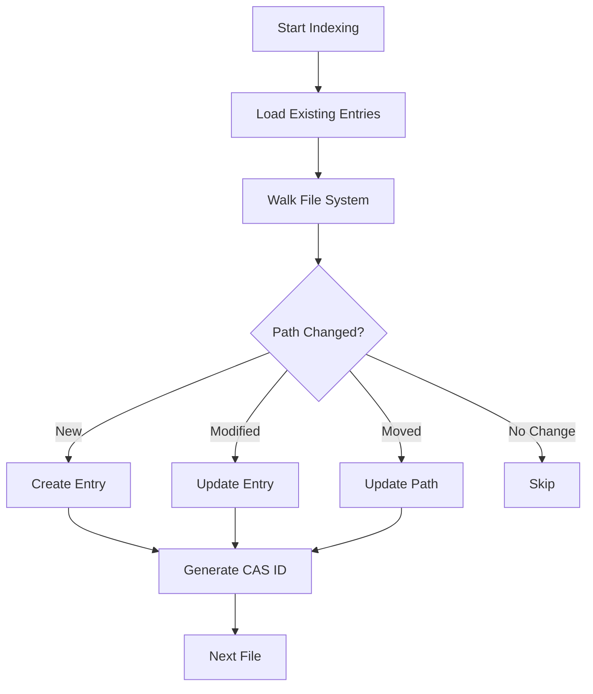

# 🚀 Production-Ready Indexer Implementation

## Overview

We've successfully built a sophisticated, modular indexer system that matches the capabilities of the original Spacedrive indexer while being production-ready. The new indexer provides all the features needed for real-world use with a clean architecture designed for future enhancements.

## 🏗️ Architecture

```
core-new/src/operations/indexing/
├── mod.rs                    # Module exports and documentation
├── job.rs                    # Main IndexerJob with state machine
├── state.rs                  # Resumable state management  
├── entry.rs                  # Entry processing with inode support
├── filters.rs                # Hardcoded filtering (future rules integration)
├── metrics.rs                # Performance tracking and reporting
├── change_detection/         # Incremental indexing support
│   └── mod.rs               # Change detection with inode tracking
└── phases/                   # Multi-phase processing
    ├── mod.rs
    ├── discovery.rs          # Directory walking with filtering
    ├── processing.rs         # Database operations with change detection
    └── content.rs            # CAS ID generation
```

## ✨ Key Features

### 1. **Production-Ready Filtering**
```rust
// From filters.rs
pub fn should_skip_path(path: &Path) -> bool {
    // Comprehensive hardcoded rules
    // TODO: Replace with IndexerRuleEngine when rules system is implemented
}
```

**Filters:**
- Hidden files (`.DS_Store`, `Thumbs.db`)
- Development directories (`node_modules`, `target`, `.git`)
- Cache directories (`.cache`, `__pycache__`)
- Temporary files
- Large files (>4GB)

### 2. **Incremental Indexing**
```rust
// Change detection with inode tracking
pub enum Change {
    New(PathBuf),
    Modified { entry_id: i32, old_modified: SystemTime, new_modified: SystemTime },
    Moved { old_path: PathBuf, new_path: PathBuf, inode: u64 },
    Deleted { path: PathBuf, entry_id: i32 },
}
```

### 3. **Multi-Phase Processing**
1. **Discovery Phase**: Walk directories, apply filters, collect entries
2. **Processing Phase**: Create/update database records, detect changes
3. **Content Phase**: Generate CAS IDs for deduplication

### 4. **Performance Metrics**
```
Indexing completed in 12.5s:
- Files: 10,234 (818.7/s)
- Directories: 1,523 (121.8/s)
- Total size: 2.34 GB (191.23 MB/s)
- Database writes: 10,234 in 11 batches (avg 930.4 items/batch)
- Errors: 5 (skipped 1,523 paths)
- Phase timing: discovery 5.2s, processing 6.1s, content 1.2s
```

### 5. **State Management**
- Full resumability with checkpoints
- Batch processing (1000 items/batch)
- Non-critical error collection
- Progress tracking with custom types

## 📊 Database Schema Enhancements

Added `inode` field to entries table for better change detection:
```sql
ALTER TABLE entries ADD COLUMN inode BIGINT;
```

## 🔄 Incremental Indexing Flow



## 🎯 Integration Points

### Rules System Integration
The `should_skip_path` function in `filters.rs` is marked as the future integration point:
```rust
/// TODO: Replace with IndexerRuleEngine when rules system is implemented
pub fn should_skip_path(path: &Path) -> bool {
    // Current hardcoded implementation
}
```

### Usage Example
```rust
// Create indexer job
let indexer = IndexerJob::with_content(
    location_id,
    SdPath::from_local_path(path),
);

// Job will be dispatched through the job manager
// Progress tracked via events
// Full resumability if interrupted
```

## 🚀 Production Benefits

1. **Efficient**: Only processes changed files on subsequent runs
2. **Resilient**: Full error recovery and resumability
3. **Observable**: Detailed metrics and progress tracking
4. **Scalable**: Batch processing prevents memory issues
5. **Extensible**: Clean architecture for future enhancements

## 📝 Future Enhancements

When the rules system is implemented:
1. Replace `should_skip_path` with `IndexerRuleEngine`
2. Add database-backed rule storage
3. Enable per-location rule customization
4. Support for `.gitignore` integration

The architecture is ready - just plug in the rules engine when it's built!