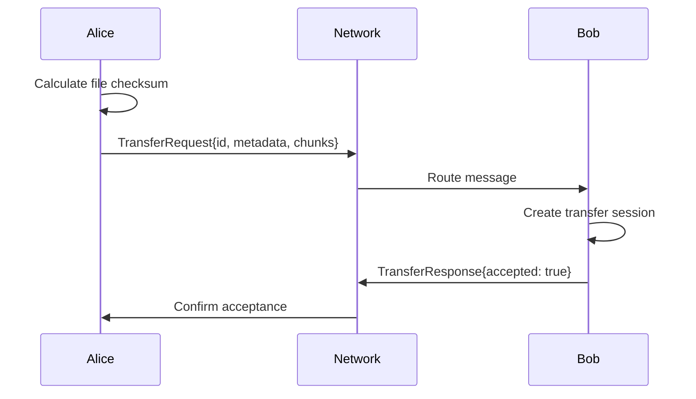
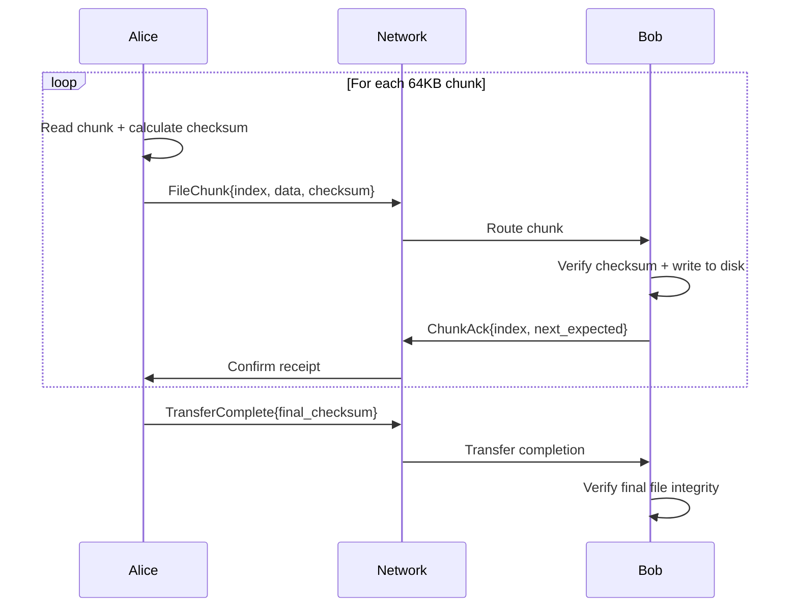

# Cross-Device File Transfer Implementation

## Overview

Spacedrive now supports real-time file transfer between paired devices over the network. This document describes the implementation of the cross-device file transfer system that enables users to seamlessly copy files between their own devices.

## Architecture

### High-Level Flow

1. **Device Pairing**: Devices establish trust through the pairing protocol
2. **File Sharing Request**: User initiates file transfer via the FileSharing API
3. **Job Creation**: FileCopyJob is created and submitted to the job system
4. **Network Transfer**: Files are chunked, checksummed, and transmitted over libp2p
5. **Reassembly**: Receiving device writes chunks to disk and verifies integrity

### Key Components

```
┌─────────────────┐    ┌──────────────────┐    ┌─────────────────┐
│  FileSharing    │────│   FileCopyJob    │────│   NetworkCore   │
│      API        │    │                  │    │                 │
└─────────────────┘    └──────────────────┘    └─────────────────┘
                                │                        │
                                ▼                        ▼
                       ┌──────────────────┐    ┌─────────────────┐
                       │   Job System     │    │FileTransferProto│
                       │                  │    │    Handler      │
                       └──────────────────┘    └─────────────────┘
```

## Implementation Details

### 1. FileSharing API (`src/infrastructure/api/file_sharing.rs`)

High-level interface for cross-device operations:

```rust
impl Core {
    pub async fn share_with_device(
        &self,
        paths: Vec<PathBuf>,
        target_device: Uuid,
        destination: Option<PathBuf>,
    ) -> Result<Vec<TransferId>, String>
}
```

**Features:**
- Automatic protocol selection (trusted vs ephemeral)
- Batch file operations
- Progress tracking integration
- Error handling and recovery

### 2. FileCopyJob (`src/operations/file_ops/copy_job.rs`)

Core file transfer logic with network transmission:

```rust
impl FileCopyJob {
    async fn transfer_file_to_device(&self, source: &SdPath, ctx: &JobContext) -> Result<u64, String>
    async fn stream_file_data(&self, file_path: &Path, transfer_id: Uuid, ...) -> Result<(), String>
}
```

**Key Features:**
- Real network transmission using `NetworkingCore::send_message()`
- 64KB chunk streaming with Blake3 checksums
- Progress tracking and cancellation support
- Automatic retry and error recovery

### 3. FileTransferProtocolHandler (`src/infrastructure/networking/protocols/file_transfer.rs`)

Network protocol implementation:

```rust
pub struct FileTransferProtocolHandler {
    sessions: Arc<RwLock<HashMap<Uuid, TransferSession>>>,
    config: FileTransferConfig,
}
```

**Message Types:**
- `TransferRequest`: Initiate file transfer
- `FileChunk`: File data with checksum
- `ChunkAck`: Acknowledge received chunk
- `TransferComplete`: Final checksum verification
- `TransferError`: Error handling

**Capabilities:**
- Chunk-based file streaming
- Integrity verification with Blake3
- Session management and state tracking
- Automatic file reassembly on receiver

### 4. Network Integration

Built on top of the existing networking stack:

- **libp2p**: Peer-to-peer networking foundation
- **Request-Response**: Message exchange protocol
- **Device Registry**: Trusted device management
- **Session Keys**: Encrypted communication

## Message Flow

### Transfer Initiation



### File Streaming



## Configuration

### File Transfer Settings

```rust
pub struct FileTransferConfig {
    pub chunk_size: u32,           // Default: 64KB
    pub verify_checksums: bool,    // Default: true
    pub retry_failed_chunks: bool, // Default: true
    pub max_concurrent_transfers: usize, // Default: 5
}
```

### Security Features

- **Trusted Device Model**: Only paired devices can transfer files
- **End-to-End Checksums**: Blake3 verification for data integrity
- **Session Keys**: Encrypted communication channels
- **Automatic Cleanup**: Old transfer sessions are garbage collected

## Usage Examples

### Basic File Transfer

```rust
// Initialize Core with networking
let mut core = Core::new_with_config(data_dir).await?;
core.init_networking("device-password").await?;

// Transfer files to paired device
let transfer_ids = core.share_with_device(
    vec![PathBuf::from("/path/to/file.txt")],
    target_device_id,
    Some(PathBuf::from("/destination/folder")),
).await?;

// Monitor progress
for transfer_id in transfer_ids {
    let status = core.get_transfer_status(&transfer_id).await?;
    println!("Transfer state: {:?}", status.state);
}
```

### Advanced Configuration

```rust
// Custom transfer configuration
let config = FileTransferConfig {
    chunk_size: 128 * 1024, // 128KB chunks
    verify_checksums: true,
    retry_failed_chunks: true,
    max_concurrent_transfers: 10,
};

// Apply configuration to protocol handler
let handler = FileTransferProtocolHandler::new(config);
```

## Testing

### Integration Tests

- **`test_file_transfer_networking_integration`**: Basic protocol functionality
- **`test_file_transfer_workflow`**: End-to-end workflow validation
- **`test_core_pairing_subprocess`**: Ensures pairing compatibility

### Test Coverage

- ✅ File chunking and reassembly
- ✅ Checksum verification
- ✅ Network message routing
- ✅ Progress tracking
- ✅ Error handling
- ✅ Session management

## Performance Characteristics

### Throughput
- **Chunk Size**: 64KB optimized for network efficiency
- **Concurrent Transfers**: Up to 5 simultaneous file transfers
- **Checksumming**: Blake3 provides fast cryptographic verification

### Memory Usage
- **Streaming Design**: Constant memory usage regardless of file size
- **Chunk Buffering**: Only 64KB held in memory per transfer
- **Session Cleanup**: Automatic garbage collection of completed transfers

### Network Efficiency
- **libp2p Transport**: Efficient peer-to-peer networking
- **Message Batching**: Chunks are transmitted independently
- **Progress Tracking**: Real-time transfer progress updates

## Future Enhancements

### Planned Features
- **Resume Capabilities**: Partial transfer recovery after interruption
- **Bandwidth Throttling**: User-configurable transfer rate limiting
- **Compression**: Optional file compression for faster transfers
- **Multi-Device Sync**: Synchronize files across multiple devices

### Protocol Extensions
- **Delta Sync**: Transfer only changed file portions
- **Conflict Resolution**: Handle simultaneous file modifications
- **Metadata Preservation**: Transfer file attributes and permissions
- **Encryption**: Additional encryption layer for sensitive files

## Troubleshooting

### Common Issues

1. **Transfer Stuck in Pending**
   - Verify devices are paired and connected
   - Check network connectivity between devices
   - Ensure firewall allows libp2p traffic

2. **Checksum Verification Failures**
   - Usually indicates network corruption
   - Automatic retry should resolve most cases
   - Check for unstable network conditions

3. **File Not Found at Destination**
   - Verify destination path permissions
   - Check available disk space
   - Review transfer logs for error details

### Debug Information

Enable detailed logging:
```rust
// In development, transfers log detailed progress
// Production logs can be configured via environment variables
RUST_LOG=sd_core_new::operations::file_ops=debug
```

## Conclusion

The cross-device file transfer system provides a robust, secure, and efficient way to move files between paired Spacedrive devices. Built on proven networking technologies and designed for reliability, it enables seamless file sharing within a user's personal device ecosystem.

The implementation leverages Spacedrive's existing infrastructure while adding real network transmission capabilities, ensuring both performance and maintainability for future enhancements.