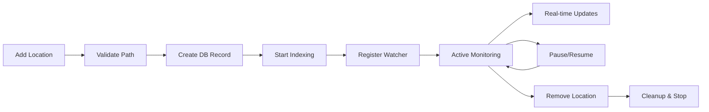
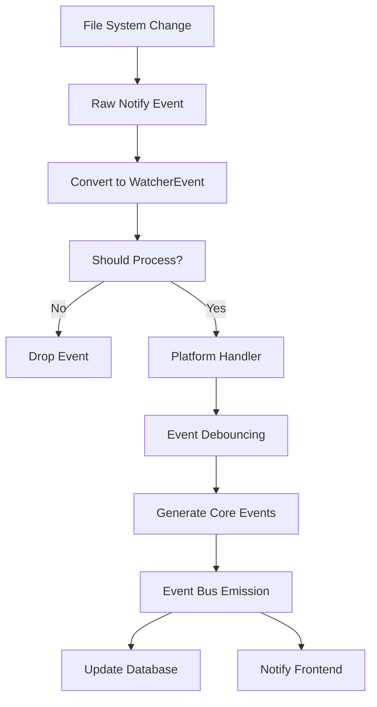

# Locations & File System Watching

## Overview

Locations are the foundation of how Spacedrive tracks and monitors your files. A location represents a directory on your device that Spacedrive actively monitors, indexes, and syncs across your library. This document covers location management and the sophisticated file system watching service that powers real-time updates.

## What is a Location?

A **Location** is a directory that you've added to your Spacedrive library for tracking. When you add a location:

1. **Initial Indexing**: Spacedrive scans all files and subdirectories
2. **Real-time Monitoring**: File system changes are detected instantly
3. **Cross-device Sync**: Location metadata syncs across all your devices
4. **Content Identification**: Files get content-addressable storage IDs for deduplication

### Location Properties

```rust
pub struct ManagedLocation {
    pub id: Uuid,                    // Unique location identifier
    pub name: String,                // Display name (e.g., "Desktop")
    pub path: PathBuf,               // Local file system path
    pub device_id: i32,              // Device this location exists on
    pub library_id: Uuid,            // Library this location belongs to
    pub indexing_enabled: bool,      // Whether to index files
    pub index_mode: IndexMode,       // How deep to index (Shallow/Content/Deep)
    pub watch_enabled: bool,         // Whether to watch for changes
}
```

### Index Modes

- **`Shallow`**: Only file metadata (name, size, dates)
- **`Content`**: Includes content hashing for deduplication
- **`Deep`**: Full media processing (thumbnails, metadata extraction)

## Location Manager

The `LocationManager` orchestrates the complete location lifecycle:

### Adding a Location

```rust
let (location_id, job_id) = location_manager
    .add_location(library, path, name, device_id, IndexMode::Content)
    .await?;
```

**What happens internally:**
1. **Path Validation**: Ensures the path exists and is accessible
2. **Duplicate Check**: Prevents adding the same path twice
3. **Database Record**: Creates persistent location record
4. **Indexing Job**: Spawns background indexer job
5. **Watcher Registration**: Adds location to file system watcher
6. **Event Emission**: Notifies other services of new location

### Location Lifecycle



## Location Watcher Service

The Location Watcher is a sophisticated service that provides real-time file system monitoring across all your locations.

### Architecture

```rust
pub struct LocationWatcher {
    config: LocationWatcherConfig,           // Service configuration
    events: Arc<EventBus>,                   // Event broadcasting
    watched_locations: HashMap<Uuid, WatchedLocation>,  // Active locations
    watcher: Option<RecommendedWatcher>,     // File system watcher
    platform_handler: Arc<PlatformHandler>, // OS-specific optimizations
}
```

### Key Features

#### 1. **Cross-Platform Monitoring**
- **Linux**: Uses `inotify` for efficient event-based monitoring
- **macOS**: Leverages `FSEvents` with volume-level watching
- **Windows**: Uses `ReadDirectoryChangesW` for real-time updates

#### 2. **Event Debouncing**
Prevents event storms by consolidating rapid changes:
```rust
pub struct LocationWatcherConfig {
    pub debounce_duration: Duration,    // Default: 100ms
    pub event_buffer_size: usize,       // Default: 1000 events
    pub debug_mode: bool,               // Detailed logging
}
```

#### 3. **Intelligent Filtering**
Automatically filters out noise:
- **Temporary files**: `.tmp`, `.temp`, `~backup`
- **System files**: `.DS_Store`, `Thumbs.db`
- **Editor files**: `.swp`, `.swo`
- **Hidden files**: Except important ones like `.gitignore`

#### 4. **Event Processing Pipeline**



### Event Types

The watcher converts file system events into structured events:

```rust
pub enum WatcherEventKind {
    Create,                              // New file/directory
    Modify,                              // Content or metadata change
    Remove,                              // File/directory deleted
    Rename { from: PathBuf, to: PathBuf }, // Move/rename operation
    Other(String),                       // Platform-specific events
}
```

### Platform-Specific Optimizations

#### macOS (`FSEvents`)
- **Volume-level monitoring** for better performance
- **Batch event processing** to handle high-frequency changes
- **Metadata change detection** for precise updates

#### Linux (`inotify`)
- **Recursive directory watching** with efficient descriptor management
- **Move detection** using cookie-based event correlation
- **Symlink handling** with loop detection

#### Windows (`ReadDirectoryChangesW`)
- **Overlapped I/O** for non-blocking operations
- **Network drive support** with appropriate polling fallbacks
- **Long path support** for paths exceeding 260 characters

## Usage Examples

### Adding a Location via CLI
```bash
# Add a location with automatic indexing
spacedrive location add ~/Documents --name "Documents"

# Add with specific index mode
spacedrive location add ~/Photos --name "Photos" --mode deep

# List all locations
spacedrive location list
```

### Programmatic Usage
```rust
use spacedrive_core::location::{LocationManager, IndexMode};

// Create location manager
let location_manager = LocationManager::new(event_bus);

// Add location
let (location_id, job_id) = location_manager
    .add_location(
        library,
        PathBuf::from("/Users/james/Desktop"),
        Some("Desktop".to_string()),
        device_id,
        IndexMode::Content,
    )
    .await?;

println!("Location {} added, indexing job: {}", location_id, job_id);
```

### Watching for Events
```rust
// Subscribe to location events
let mut event_stream = event_bus.subscribe();

while let Ok(event) = event_stream.recv().await {
    match event {
        Event::LocationAdded { location_id, .. } => {
            println!("New location added: {}", location_id);
        }
        Event::EntryCreated { entry_id, .. } => {
            println!("New file detected: {}", entry_id);
        }
        Event::EntryModified { entry_id, .. } => {
            println!("File modified: {}", entry_id);
        }
        _ => {}
    }
}
```

## Configuration & Tuning

### Watcher Configuration
```rust
let config = LocationWatcherConfig {
    debounce_duration: Duration::from_millis(500),  // Slower for high-frequency changes
    event_buffer_size: 2000,                        // Larger buffer for busy directories
    debug_mode: true,                               // Enable for troubleshooting
};
```

### Performance Considerations

#### For Large Directories (>100k files)
- **Increase buffer size**: Prevent event loss during initial scans
- **Longer debounce**: Reduce CPU usage during bulk operations
- **Selective watching**: Consider excluding build/cache directories

#### For Network Drives
- **Polling fallback**: Some network filesystems don't support native events
- **Reduced sensitivity**: Longer polling intervals to avoid network spam
- **Connection monitoring**: Handle temporary disconnections gracefully

#### For SSD vs HDD
- **SSD**: Shorter debounce times, higher buffer sizes
- **HDD**: Longer debounce to handle mechanical latency

## Troubleshooting

### Common Issues

#### 1. **High CPU Usage**
```bash
# Check if specific directories are causing event storms
spacedrive location list --verbose

# Temporarily disable watching for problematic locations
spacedrive location update <location-id> --watch false
```

#### 2. **Missing File Changes**
- **Check permissions**: Ensure Spacedrive can read the directory
- **Verify watching**: Confirm the location has watching enabled
- **Platform limits**: Some platforms have file descriptor limits

#### 3. **Duplicate Events**
- **Increase debounce**: Some editors create multiple rapid changes
- **Check for symlinks**: Ensure you're not watching the same directory twice

### Debug Mode
Enable debug logging to see detailed event information:
```rust
LocationWatcherConfig {
    debug_mode: true,
    ..Default::default()
}
```

This outputs detailed logs like:
```
DEBUG Raw file system event: Event { kind: Create(File), paths: ["/Users/james/test.txt"] }
DEBUG WatcherEvent processed: Create { path: "/Users/james/test.txt", timestamp: 2024-01-15T10:30:45Z }
```

## Event Bus Integration

The Location Watcher integrates seamlessly with Spacedrive's event system:

### Events Emitted
- `Event::LocationAdded` - New location added to library
- `Event::LocationRemoved` - Location removed from library
- `Event::EntryCreated` - New file/directory detected
- `Event::EntryModified` - File content or metadata changed
- `Event::EntryDeleted` - File/directory removed
- `Event::EntryMoved` - File/directory moved or renamed

### Event Consumption
Other services subscribe to these events:
- **Indexer**: Re-indexes modified files
- **Search**: Updates search index
- **Sync**: Propagates changes to other devices
- **Frontend**: Updates UI in real-time

## Future Enhancements

### Planned Features
- **Smart exclusion patterns**: Automatically learn to ignore build directories
- **Bandwidth-aware syncing**: Adjust sync frequency based on connection quality
- **Conflict resolution**: Handle simultaneous edits across devices
- **Version history**: Track file changes over time
- **AI-powered organization**: Automatically suggest better folder structures

### Performance Improvements
- **Event compression**: Combine related events for efficiency
- **Predictive prefetching**: Pre-load likely-to-be-accessed files
- **Adaptive polling**: Adjust watch frequency based on directory activity
- **Background processing**: Move heavy operations off the critical path

## Related Documentation

- [Indexing System](./indexing.md) - How files are analyzed and processed
- [Job System](./job-system.md) - Background task management
- [Database Schema](./database.md) - Location storage and relationships
- [Event System](./events.md) - Inter-service communication
- [CLI Usage](./cli.md) - Command-line location management

---

The location and watching system forms the foundation of Spacedrive's real-time file management capabilities. By efficiently monitoring file system changes and integrating with the broader architecture, it enables the seamless cross-device experience that makes Spacedrive unique.