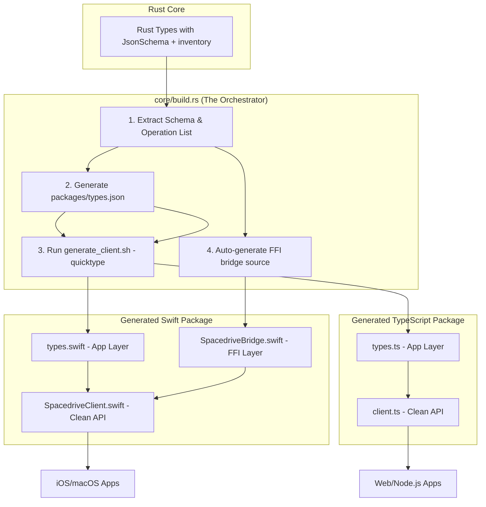

# Spacedrive Client Generation System Design Document

## 1. Overview

This document outlines the design for an automated type-safe client generation system for Spacedrive, building on the proven JSON Schema + quicktype approach. The system will generate Swift and TypeScript clients that provide type-safe access to Spacedrive's daemon API through three core methods: `executeQuery`, `executeAction`, and `subscribe`.

## 2. Architecture Goals

- **Single Source of Truth**: Rust types define the canonical interface
- **Type Safety**: Full compile-time type checking in target languages
- **Automation**: Zero-maintenance client generation
- **Simplicity**: Minimal API surface with three core methods and single type file
- **Performance**: Efficient bincode serialization
- **Extensibility**: Easy to add new target languages

## 3. System Architecture

### 3.1 High-Level Flow



### 3.2 Directory Structure

```
spacedrive/
├── core/
│   ├── src/
│   │   ├── codegen/              # 🆕 Client generation system
│   │   │   ├── mod.rs           # Main orchestrator
│   │   │   ├── extractor.rs     # Extract registered operations
│   │   │   └── schema.rs        # Generate unified JSON schema
│   │   ├── ops/                 # Enhanced with JsonSchema derives
│   │   └── ...
│   ├── build.rs                 # 🔄 Triggers client generation
│   └── Cargo.toml              # Add schemars dependency
├── packages/
│   ├── types.json               # 🆕 Single unified schema file
│   ├── swift-client/            # 🆕 Generated Swift client
│   │   ├── Package.swift
│   │   ├── Sources/SpacedriveClient/
│   │   │   ├── SpacedriveClient.swift    # Clean API facade
│   │   │   └── types.swift              # 🤖 Generated by quicktype
│   │   ├── sd-swift-bridge/             # 🤖 Generated FFI bridge
│   │   │   ├── Cargo.toml
│   │   │   └── src/lib.rs               # 🤖 Generated by build.rs
│   │   ├── Tests/
│   │   └── generate_client.sh
│   └── ts-client/               # 🆕 Generated TypeScript client
│       ├── package.json
│       ├── src/
│       │   ├── index.ts
│       │   ├── client.ts                # Clean API
│       │   ├── types.ts                 # 🤖 Generated by quicktype
│       │   ├── transport.ts
│       │   └── serialization.ts
│       ├── tests/
│       └── generate_client.sh
```

## 4. Core Components

### 4.1 Schema Extraction System

#### 4.1.1 Enhanced Rust Types

All Spacedrive operation types must include `JsonSchema` derive:

```rust
// core/src/ops/core/status/query.rs
#[derive(Debug, Clone, Serialize, Deserialize, JsonSchema)]
pub struct CoreStatusQuery;

// core/src/ops/core/status/output.rs
#[derive(Debug, Clone, Serialize, Deserialize, JsonSchema)]
pub struct CoreStatus {
    pub version: String,
    pub built_at: String,
    pub library_count: usize,
    pub device_info: DeviceInfo,
    pub libraries: Vec<LibraryInfo>,
    pub services: ServiceStatus,
    pub network: NetworkStatus,
    pub system: SystemInfo,
}

// core/src/ops/files/copy/input.rs
#[derive(Debug, Clone, Serialize, Deserialize, JsonSchema)]
pub struct FileCopyInput {
    pub sources: SdPathBatch,
    pub destination: SdPath,
    pub overwrite: bool,
    pub verify_checksum: bool,
    pub preserve_timestamps: bool,
    pub move_files: bool,
    pub copy_method: CopyMethod,
    pub on_conflict: Option<FileConflictResolution>,
}

// core/src/infra/event/mod.rs
#[derive(Debug, Clone, Serialize, Deserialize, JsonSchema)]
pub enum Event {
    CoreStarted,
    CoreShutdown,
    LibraryCreated { id: Uuid, name: String, path: PathBuf },
    JobStarted { job_id: String, job_type: String },
    JobProgress { job_id: String, job_type: String, progress: f64, message: Option<String> },
    // ... all event variants
}
```

#### 4.1.2 Schema Extractor (`core/src/codegen/extractor.rs`)

```rust
use schemars::{schema_for, JsonSchema, Schema};
use crate::ops::registry::{QUERIES, ACTIONS};
use crate::infra::event::Event;
use std::collections::HashMap;

pub struct OperationMetadata {
    pub method: String,
    pub input_schema: Option<Schema>,
    pub output_schema: Schema,
    pub operation_type: OperationType,
}

pub enum OperationType {
    Query,
    LibraryAction,
    CoreAction,
}

pub struct UnifiedSchema {
    pub queries: Vec<OperationMetadata>,
    pub actions: Vec<OperationMetadata>,
    pub events: Schema,
    pub core_types: HashMap<String, Schema>,
}

impl UnifiedSchema {
    pub fn extract() -> Result<Self, ExtractionError> {
        let mut schema = UnifiedSchema {
            queries: Vec::new(),
            actions: Vec::new(),
            events: schema_for!(Event),
            core_types: HashMap::new(),
        };

        // Extract query metadata
        schema.extract_queries()?;

        // Extract action metadata
        schema.extract_actions()?;

        // Extract common types used across operations
        schema.extract_core_types()?;

        Ok(schema)
    }

    fn extract_queries(&mut self) -> Result<(), ExtractionError> {
        // Use inventory to iterate over registered queries
        for entry in inventory::iter::<crate::ops::registry::QueryEntry>() {
            let metadata = self.extract_query_metadata(entry)?;
            self.queries.push(metadata);
        }
        Ok(())
    }

    fn extract_actions(&mut self) -> Result<(), ExtractionError> {
        // Use inventory to iterate over registered actions
        for entry in inventory::iter::<crate::ops::registry::ActionEntry>() {
            let metadata = self.extract_action_metadata(entry)?;
            self.actions.push(metadata);
        }
        Ok(())
    }

    pub fn write_unified_schema(&self, output_path: &Path) -> Result<(), std::io::Error> {
        let unified = serde_json::json!({
            "queries": self.queries.iter().map(|q| serde_json::json!({
                "method": q.method,
                "input": q.input_schema,
                "output": q.output_schema
            })).collect::<Vec<_>>(),
            "actions": self.actions.iter().map(|a| serde_json::json!({
                "method": a.method,
                "input": a.input_schema,
                "output": a.output_schema
            })).collect::<Vec<_>>(),
            "events": self.events,
            "types": self.core_types
        });

        std::fs::write(output_path, serde_json::to_string_pretty(&unified)?)?;
        Ok(())
    }
}
```

#### 4.1.3 Build Integration (`core/build.rs`) - **The REAL Orchestrator**

This script now does everything. It uses the `UnifiedSchema` it extracts not only to create the `types.json` but also to write the entire Rust source file for the FFI bridge.

```rust
use std::fs;
use std::path::Path;
use std::process::Command;

fn main() {
    println!("cargo:rerun-if-changed=src/ops");
    println!("cargo:rerun-if-changed=src/infra/event");

    // Extract schemas during build
    if let Err(e) = generate_client_schemas() {
        println!("cargo:warning=Failed to generate client schemas: {}", e);
    }
}

fn generate_client_schemas() -> Result<(), Box<dyn std::error::Error>> {
    // Step 1: Extract the unified schema
    let schema = crate::codegen::extractor::UnifiedSchema::extract()?;

    // Step 2: Write to packages/types.json
    let schema_path = Path::new("../packages/types.json");
    schema.write_unified_schema(schema_path)?;

    // Step 3: 💥 NEW - Auto-generate the Rust FFI bridge source code
    generate_ffi_bridge_source(&schema)?;

    // Step 4: Trigger the quicktype generation scripts
    trigger_client_generation()?;

    Ok(())
}

/// GENERATES THE ENTIRE `lib.rs` FOR THE SWIFT BRIDGE CRATE
fn generate_ffi_bridge_source(schema: &UnifiedSchema) -> Result<(), std::io::Error> {
    let mut ffi_code = String::new();

    // Add necessary imports and attributes
    ffi_code.push_str(r#"#[swift_bridge::bridge]
mod ffi {
    extern "Rust" {
        type SpacedriveFfiClient;

        #[swift_bridge(init)]
        fn new(socket_path: &str) -> SpacedriveFfiClient;

        // JSON is used as the bridge format to avoid bincode complexity in Swift
        #[swift_bridge(swift_name = "executeQuery")]
        async fn execute_query(&self, method: &str, payload_json: &str) -> Result<String, String>;

        #[swift_bridge(swift_name = "executeAction")]
        async fn execute_action(&self, method: &str, payload_json: &str) -> Result<String, String>;

        #[swift_bridge(swift_name = "subscribe")]
        fn subscribe(&self, event_types: Vec<String>) -> AsyncStream<String>;
    }
}

use sd_core::client::CoreClient;
use std::path::PathBuf;
use tokio_stream::{Stream, StreamExt};

pub struct SpacedriveFfiClient {
    core_client: CoreClient,
}

impl SpacedriveFfiClient {
    pub fn new(socket_path: &str) -> Self {
        Self {
            core_client: CoreClient::new(PathBuf::from(socket_path)),
        }
    }

    pub async fn execute_query(&self, method: &str, payload_json: &str) -> Result<String, String> {
        // Parse JSON input, convert to bincode, send via CoreClient, convert result back to JSON
        // This hides all bincode complexity from Swift
        todo!("Implement JSON->bincode->JSON bridge")
    }

    pub async fn execute_action(&self, method: &str, payload_json: &str) -> Result<String, String> {
        // Similar to execute_query but for actions
        todo!("Implement JSON->bincode->JSON bridge")
    }

    pub fn subscribe(&self, event_types: Vec<String>) -> impl Stream<Item = String> {
        // Subscribe to events and convert to JSON strings
        todo!("Implement event subscription with JSON conversion")
    }
}
"#);

    // Write the generated FFI bridge
    let bridge_dir = Path::new("../packages/swift-client/sd-swift-bridge");
    std::fs::create_dir_all(bridge_dir)?;
    std::fs::create_dir_all(bridge_dir.join("src"))?;

    let bridge_path = bridge_dir.join("src/lib.rs");
    fs::write(bridge_path, ffi_code)?;

    // Generate Cargo.toml for the bridge
    let cargo_toml = r#"[package]
name = "sd-swift-bridge"
version = "0.1.0"
edition = "2021"

[dependencies]
swift-bridge = "0.1"
sd-core = { path = "../../../core" }
tokio = { version = "1.0", features = ["full"] }
tokio-stream = "0.1"
serde_json = "1.0"

[lib]
crate-type = ["staticlib"]
"#;

    fs::write(bridge_dir.join("Cargo.toml"), cargo_toml)?;

    Ok(())
}

fn trigger_client_generation() -> Result<(), Box<dyn std::error::Error>> {
    // Run Swift client generation
    Command::new("bash")
        .arg("../packages/swift-client/generate_client.sh")
        .status()?;

    // Run TypeScript client generation
    Command::new("bash")
        .arg("../packages/ts-client/generate_client.sh")
        .status()?;

    Ok(())
}
```

### 4.2 Client Generation Scripts

#### 4.2.1 Swift Client Generator (`packages/swift-client/generate_client.sh`)

```bash
#!/bin/bash

set -e

echo "🦀➡️🍎 Generating Spacedrive Swift Client"
echo "=========================================="

# Colors for output
RED='\033[0;31m'
GREEN='\033[0;32m'
BLUE='\033[0;34m'
YELLOW='\033[1;33m'
NC='\033[0m'

SCHEMA_FILE="../types.json"
GENERATED_TYPES_FILE="Sources/SpacedriveClient/types.swift"

# Check if schema file exists
if [ ! -f "$SCHEMA_FILE" ]; then
    echo -e "${RED}❌ Schema file not found: $SCHEMA_FILE${NC}"
    exit 1
fi

# Step 1: Generate Swift types from unified schema (App Layer)
echo -e "${BLUE}Generating Swift types from unified schema...${NC}"

quicktype -s schema "$SCHEMA_FILE" \
    -o "$GENERATED_TYPES_FILE" \
    --lang swift \
    --top-level SpacedriveTypes \
    --struct-or-class struct \
    --protocol Codable \
    --density dense \
    --alphabetize-properties

if [ ! -f "$GENERATED_TYPES_FILE" ]; then
    echo -e "${RED}❌ Failed to generate types.swift${NC}"
    exit 1
fi

echo -e "${GREEN}✅ Generated types.swift (App Layer)${NC}"

# Step 2: Build the FFI bridge (generated by build.rs)
echo -e "${BLUE}Building FFI bridge...${NC}"
cd sd-swift-bridge
cargo build --release
cd ..

# Step 3: Generate Swift bridge bindings (FFI Layer)
echo -e "${BLUE}Generating Swift bridge bindings...${NC}"
cd sd-swift-bridge
swift-bridge-cli create-package \
    --bridges-dir ./generated \
    --out-dir ../Sources/SpacedriveClient \
    --ios \
    --macos \
    --name SpacedriveBridge
cd ..

echo -e "${GREEN}✅ Generated SpacedriveBridge.swift (FFI Layer)${NC}"

# Step 4: Build Swift package
echo -e "${BLUE}Building Swift package...${NC}"
swift build

if [ $? -eq 0 ]; then
    echo -e "${GREEN}✅ Swift build successful${NC}"
else
    echo -e "${RED}❌ Swift build failed${NC}"
    exit 1
fi

# Step 5: Run tests
echo -e "${BLUE}Running tests...${NC}"
swift test

echo -e "${GREEN}🎉 Swift client generation completed successfully!${NC}"
echo
echo -e "${YELLOW}📁 Generated files:${NC}"
echo "  - $GENERATED_TYPES_FILE (App Layer - quicktype generated)"
echo "  - Sources/SpacedriveClient/SpacedriveBridge.swift (FFI Layer - swift-bridge generated)"
echo "  - sd-swift-bridge/src/lib.rs (FFI Implementation - build.rs generated)"
echo
echo -e "${YELLOW}🔄 To regenerate types after changing Rust structs:${NC}"
echo "  ./generate_client.sh"
```

#### 4.2.2 TypeScript Client Generator (`packages/ts-client/generate_client.sh`)

```bash
#!/bin/bash

set -e

echo "🦀➡️📜 Generating Spacedrive TypeScript Client"
echo "============================================="

# Colors for output
RED='\033[0;31m'
GREEN='\033[0;32m'
BLUE='\033[0;34m'
YELLOW='\033[1;33m'
NC='\033[0m'

SCHEMA_FILE="../types.json"
GENERATED_FILE="src/types.ts"

# Check if schema file exists
if [ ! -f "$SCHEMA_FILE" ]; then
    echo -e "${RED}❌ Schema file not found: $SCHEMA_FILE${NC}"
    exit 1
fi

# Generate TypeScript types from unified schema
echo -e "${BLUE}Generating TypeScript types from unified schema...${NC}"

quicktype -s schema "$SCHEMA_FILE" \
    -o "$GENERATED_FILE" \
    --lang typescript \
    --top-level SpacedriveTypes \
    --prefer-unions \
    --alphabetize-properties

if [ ! -f "$GENERATED_FILE" ]; then
    echo -e "${RED}❌ Failed to generate types.ts${NC}"
    exit 1
fi

echo -e "${GREEN}✅ Generated types.ts${NC}"

# Build TypeScript
echo -e "${BLUE}Building TypeScript...${NC}"
npm run build

if [ $? -eq 0 ]; then
    echo -e "${GREEN}✅ TypeScript build successful${NC}"
else
    echo -e "${RED}❌ TypeScript build failed${NC}"
    exit 1
fi

# Run tests
echo -e "${BLUE}Running tests...${NC}"
npm test

echo -e "${GREEN}🎉 TypeScript client generation completed successfully!${NC}"
echo
echo -e "${YELLOW}📁 Generated files:${NC}"
echo "  - $GENERATED_FILE (TypeScript types from unified schema)"
echo
echo -e "${YELLOW}🔄 To regenerate types after changing Rust structs:${NC}"
echo "  ./generate_client.sh"
```

## 5. Client Implementation

### 5.1 Swift Client

#### 5.1.1 Main Client (`packages/swift-client/Sources/SpacedriveClient/SpacedriveClient.swift`) - **The Clean Facade**

The Swift client now becomes a beautiful, clean facade. It works **only with the `quicktype`-generated types** and hides the ugly FFI layer completely. The developer using this client has no idea `swift-bridge` or `bincode` even exist.

```swift
import Foundation

// These types are from `types.swift` (generated by quicktype)
public typealias CoreStatus = SpacedriveTypes.CoreStatus
public typealias CoreStatusQuery = SpacedriveTypes.CoreStatusQuery
public typealias FileCopyInput = SpacedriveTypes.FileCopyInput
public typealias JobHandle = SpacedriveTypes.JobHandle
public typealias Event = SpacedriveTypes.Event
public typealias EventFilter = SpacedriveTypes.EventFilter

public class SpacedriveClient {
    // The FFI bridge, an internal implementation detail
    private let ffiClient: SpacedriveFfiClient

    public init(socketPath: String) {
        self.ffiClient = SpacedriveFfiClient(socketPath: socketPath)
    }

    // MARK: - Core API Methods

    /// Execute a query operation
    public func executeQuery<Q: Codable, R: Codable>(
        _ query: Q,
        method: String,
        responseType: R.Type
    ) async throws -> R {
        // 1. Encode input to JSON String (universally easy)
        let inputJson = try String(data: JSONEncoder().encode(query), encoding: .utf8)!

        // 2. Call the FFI bridge, which handles bincode internally
        let resultJson = try await ffiClient.executeQuery(method: method, payloadJson: inputJson)

        // 3. Decode the JSON string response
        return try JSONDecoder().decode(R.self, from: resultJson.data(using: .utf8)!)
    }

    /// Execute an action operation
    public func executeAction<A: Codable, R: Codable>(
        _ action: A,
        method: String,
        responseType: R.Type
    ) async throws -> R {
        // 1. Encode input to JSON String
        let inputJson = try String(data: JSONEncoder().encode(action), encoding: .utf8)!

        // 2. Call the FFI bridge
        let resultJson = try await ffiClient.executeAction(method: method, payloadJson: inputJson)

        // 3. Decode the JSON string response
        return try JSONDecoder().decode(R.self, from: resultJson.data(using: .utf8)!)
    }

    /// Subscribe to events
    public func subscribe(
        to eventTypes: [String] = [],
        filter: EventFilter? = nil
    ) -> AsyncThrowingStream<Event, Error> {
        AsyncThrowingStream { continuation in
            let stream = self.ffiClient.subscribe(eventTypes: eventTypes)
            Task {
                // The FFI bridge returns JSON strings, we decode them to Event objects
                for await jsonString in stream {
                    do {
                        let event = try JSONDecoder().decode(Event.self, from: jsonString.data(using: .utf8)!)
                        continuation.yield(event)
                    } catch {
                        continuation.finish(throwing: error)
                        break
                    }
                }
                continuation.finish()
            }
        }
    }
}

// MARK: - Error Types

public enum SpacedriveError: Error {
    case connectionFailed(String)
    case serializationError(String)
    case daemonError(String)
    case invalidResponse(String)
}

// MARK: - Usage Examples

extension SpacedriveClient {
    /// Example: Get core status
    public func getCoreStatus() async throws -> CoreStatus {
        return try await executeQuery(
            CoreStatusQuery(),
            method: "query:core.status.v1",
            responseType: CoreStatus.self
        )
    }

    /// Example: Copy files
    public func copyFiles(_ input: FileCopyInput) async throws -> JobHandle {
        return try await executeAction(
            input,
            method: "action:files.copy.input.v1",
            responseType: JobHandle.self
        )
    }
}
```

#### 5.1.2 Package Configuration (`packages/swift-client/Package.swift`)

The Swift package now includes both the FFI bridge and the clean API:

```swift
// swift-tools-version: 5.9
import PackageDescription

let package = Package(
    name: "SpacedriveClient",
    platforms: [
        .macOS(.v13),
        .iOS(.v16)
    ],
    products: [
        .library(
            name: "SpacedriveClient",
            targets: ["SpacedriveClient"]
        ),
    ],
    dependencies: [
        // No external dependencies needed - everything is generated!
    ],
    targets: [
        .target(
            name: "SpacedriveClient",
            dependencies: ["SpacedriveBridge"],
            path: "Sources/SpacedriveClient"
        ),
        .binaryTarget(
            name: "SpacedriveBridge",
            path: "sd-swift-bridge/target/release/libsd_swift_bridge.a"
        ),
        .testTarget(
            name: "SpacedriveClientTests",
            dependencies: ["SpacedriveClient"]
        ),
    ]
)
```

**Key Architecture Points:**

1. **Two-File System**:
   - `types.swift` (App Layer) - Beautiful, idiomatic Swift types from quicktype
   - `SpacedriveBridge.swift` (FFI Layer) - Generated by swift-bridge, hidden from app developers

2. **Complete Automation**:
   - `build.rs` generates the entire FFI bridge Rust source
   - `generate_client.sh` orchestrates quicktype + swift-bridge
   - Zero manual type definitions anywhere

3. **Clean Separation**:
   - App developers only see and use `SpacedriveClient` with quicktype types
   - All bincode/FFI complexity is completely hidden
   - JSON is used as the bridge format for simplicity

### 5.2 TypeScript Client

#### 5.2.1 Main Client (`packages/ts-client/src/client.ts`)

```typescript
import { Transport, UnixSocketTransport } from './transport';
import { BincodeSerializer } from './serialization';
import { DaemonRequest, DaemonResponse, Event, EventFilter } from './types';

export class SpacedriveClient {
    private transport: Transport;
    private serializer: BincodeSerializer;

    constructor(socketPath: string) {
        this.transport = new UnixSocketTransport(socketPath);
        this.serializer = new BincodeSerializer();
    }

    // Core API Methods

    async executeQuery<Q, R>(
        query: Q,
        method: string
    ): Promise<R> {
        const request: DaemonRequest = {
            Query: {
                method,
                payload: await this.serializer.encode(query)
            }
        };

        const response = await this.transport.send(request);

        if ('Ok' in response) {
            return await this.serializer.decode<R>(response.Ok);
        } else if ('Error' in response) {
            throw new Error(`Daemon error: ${response.Error}`);
        } else {
            throw new Error(`Unexpected response: ${JSON.stringify(response)}`);
        }
    }

    async executeAction<A, R>(
        action: A,
        method: string
    ): Promise<R> {
        const request: DaemonRequest = {
            Action: {
                method,
                payload: await this.serializer.encode(action)
            }
        };

        const response = await this.transport.send(request);

        if ('Ok' in response) {
            return await this.serializer.decode<R>(response.Ok);
        } else if ('Error' in response) {
            throw new Error(`Daemon error: ${response.Error}`);
        } else {
            throw new Error(`Unexpected response: ${JSON.stringify(response)}`);
        }
    }

    async* subscribe(
        eventTypes: string[] = [],
        filter?: EventFilter
    ): AsyncGenerator<Event, void, unknown> {
        const request: DaemonRequest = {
            Subscribe: {
                event_types: eventTypes,
                filter
            }
        };

        const eventStream = this.transport.subscribe(request);

        for await (const event of eventStream) {
            yield event;
        }
    }
}

// Usage Examples
export class SpacedriveClientExamples {
    constructor(private client: SpacedriveClient) {}

    async getCoreStatus(): Promise<CoreStatus> {
        return this.client.executeQuery(
            {},  // CoreStatusQuery has no fields
            "query:core.status.v1"
        );
    }

    async copyFiles(input: FileCopyInput): Promise<JobHandle> {
        return this.client.executeAction(
            input,
            "action:files.copy.input.v1"
        );
    }
}
```

#### 5.2.2 Transport Layer (`packages/ts-client/src/transport.ts`)

```typescript
import * as net from 'net';
import { DaemonRequest, DaemonResponse, Event } from './types';

export interface Transport {
    send(request: DaemonRequest): Promise<DaemonResponse>;
    subscribe(request: DaemonRequest): AsyncGenerator<Event, void, unknown>;
}

export class UnixSocketTransport implements Transport {
    constructor(private socketPath: string) {}

    async send(request: DaemonRequest): Promise<DaemonResponse> {
        return new Promise((resolve, reject) => {
            const socket = net.createConnection(this.socketPath);

            socket.on('connect', () => {
                const requestData = JSON.stringify(request);
                socket.write(requestData);
                socket.end();
            });

            let responseData = '';
            socket.on('data', (data) => {
                responseData += data.toString();
            });

            socket.on('end', () => {
                try {
                    const response = JSON.parse(responseData);
                    resolve(response);
                } catch (error) {
                    reject(new Error(`Failed to parse response: ${error}`));
                }
            });

            socket.on('error', (error) => {
                reject(new Error(`Socket error: ${error.message}`));
            });
        });
    }

    async* subscribe(request: DaemonRequest): AsyncGenerator<Event, void, unknown> {
        const socket = net.createConnection(this.socketPath);

        await new Promise<void>((resolve, reject) => {
            socket.on('connect', () => {
                const requestData = JSON.stringify(request);
                socket.write(requestData);
                resolve();
            });
            socket.on('error', reject);
        });

        let buffer = '';

        for await (const chunk of socket) {
            buffer += chunk.toString();

            // Process complete JSON messages (line-delimited)
            const lines = buffer.split('\n');
            buffer = lines.pop() || ''; // Keep incomplete line in buffer

            for (const line of lines) {
                if (line.trim()) {
                    try {
                        const response = JSON.parse(line);
                        if ('Event' in response) {
                            yield response.Event;
                        }
                    } catch (error) {
                        console.error('Failed to parse event:', error);
                    }
                }
            }
        }
    }
}
```

## 6. Type Mapping

### 6.1 Rust to Swift

| Rust Type | Swift Type | Notes |
|-----------|------------|-------|
| `String` | `String` | Direct mapping |
| `Vec<T>` | `[T]` | Array type |
| `Option<T>` | `T?` | Optional type |
| `HashMap<K, V>` | `[K: V]` | Dictionary type |
| `Uuid` | `UUID` | Foundation UUID |
| `DateTime<Utc>` | `Date` | Foundation Date |
| `u64`, `i64` | `Int` | 64-bit integer |
| `u32`, `i32` | `Int32` | 32-bit integer |
| `f64` | `Double` | Double precision |
| `bool` | `Bool` | Boolean type |
| `PathBuf` | `String` | Path as string |

### 6.2 Rust to TypeScript

| Rust Type | TypeScript Type | Notes |
|-----------|-----------------|-------|
| `String` | `string` | Direct mapping |
| `Vec<T>` | `T[]` | Array type |
| `Option<T>` | `T \| null` | Union with null |
| `HashMap<K, V>` | `Record<K, V>` | Object type |
| `Uuid` | `string` | UUID as string |
| `DateTime<Utc>` | `Date` | JavaScript Date |
| `u64`, `i64` | `number` | JavaScript number |
| `u32`, `i32` | `number` | JavaScript number |
| `f64` | `number` | JavaScript number |
| `bool` | `boolean` | Boolean type |
| `PathBuf` | `string` | Path as string |

## 7. Usage Examples

### 7.1 Swift Usage

```swift
import SpacedriveClient

let client = SpacedriveClient(socketPath: "/path/to/daemon.sock")

// Query example
let status = try await client.executeQuery(
    CoreStatusQuery(),
    method: "query:core.status.v1",
    responseType: CoreStatus.self
)
print("Spacedrive version: \(status.version)")

// Action example
let copyInput = FileCopyInput(
    sources: [SdPath(path: "/source/file.txt")],
    destination: SdPath(path: "/dest/"),
    overwrite: false,
    verifyChecksum: true,
    preserveTimestamps: true,
    moveFiles: false,
    copyMethod: .auto,
    onConflict: nil
)

let jobHandle = try await client.executeAction(
    copyInput,
    method: "action:files.copy.input.v1",
    responseType: JobHandle.self
)
print("Copy job started: \(jobHandle.id)")

// Event subscription
for await event in client.subscribe(to: ["JobProgress", "JobCompleted"]) {
    switch event {
    case .jobProgress(let jobId, let jobType, let progress, let message):
        print("Job \(jobId) progress: \(progress * 100)%")
    case .jobCompleted(let jobId, let jobType, let output):
        print("Job \(jobId) completed")
    default:
        print("Other event: \(event)")
    }
}
```

### 7.2 TypeScript Usage

```typescript
import { SpacedriveClient } from '@spacedrive/client';

const client = new SpacedriveClient('/path/to/daemon.sock');

// Query example
const status = await client.executeQuery<{}, CoreStatus>(
    {},
    "query:core.status.v1"
);
console.log(`Spacedrive version: ${status.version}`);

// Action example
const copyInput: FileCopyInput = {
    sources: [{ path: "/source/file.txt" }],
    destination: { path: "/dest/" },
    overwrite: false,
    verify_checksum: true,
    preserve_timestamps: true,
    move_files: false,
    copy_method: "Auto",
    on_conflict: null
};

const jobHandle = await client.executeAction<FileCopyInput, JobHandle>(
    copyInput,
    "action:files.copy.input.v1"
);
console.log(`Copy job started: ${jobHandle.id}`);

// Event subscription
for await (const event of client.subscribe(["JobProgress", "JobCompleted"])) {
    if ('JobProgress' in event) {
        const { job_id, progress } = event.JobProgress;
        console.log(`Job ${job_id} progress: ${progress * 100}%`);
    } else if ('JobCompleted' in event) {
        const { job_id } = event.JobCompleted;
        console.log(`Job ${job_id} completed`);
    }
}
```

## 8. Implementation Phases

### Phase 1: Core Infrastructure (Week 1-2)
- [ ] Add `schemars` dependency to core
- [ ] Add `JsonSchema` derives to key types (CoreStatus, Event, etc.)
- [ ] Implement unified schema extraction system
- [ ] Create basic build script integration
- [ ] Generate single `types.json` file

### Phase 2: Swift Client (Week 2-3)
- [ ] Create Swift package structure
- [ ] Implement generation script using quicktype for single file
- [ ] Build transport layer with Unix sockets
- [ ] Implement bincode serialization (or fallback)
- [ ] Create basic client with three core methods

### Phase 3: TypeScript Client (Week 3-4)
- [ ] Create TypeScript package structure
- [ ] Implement generation script using quicktype for single file
- [ ] Build transport layer for Node.js
- [ ] Implement bincode serialization
- [ ] Create basic client with three core methods

### Phase 4: Testing & Documentation (Week 4-5)
- [ ] Add comprehensive tests for both clients
- [ ] Create usage documentation
- [ ] Add CI/CD for automatic regeneration
- [ ] Performance testing and optimization

### Phase 5: Enhancement (Week 5-6)
- [ ] Add all remaining Spacedrive operations
- [ ] Improve error handling and edge cases
- [ ] Add client-side validation
- [ ] Create example applications

## 9. Dependencies

### Rust Dependencies
```toml
# core/Cargo.toml
[dependencies]
schemars = "0.8"
serde = { version = "1.0", features = ["derive"] }
serde_json = "1.0"
inventory = "0.3"
```

### Swift Dependencies
```swift
// packages/swift-client/Package.swift
dependencies: [
    // No external dependencies needed - everything is generated!
    // FFI bridge is built as static library
]
```

### TypeScript Dependencies
```json
{
  "dependencies": {
    "@msgpack/msgpack": "^3.0.0"
  },
  "devDependencies": {
    "quicktype": "^23.0.0",
    "typescript": "^5.0.0"
  }
}
```

### System Dependencies
- Node.js and npm (for quicktype)
- Swift 5.9+ (for Swift client)
- Rust 1.70+ (for core)
- swift-bridge-cli (for FFI generation)

## 10. Benefits & Trade-offs

### Benefits
- **Type Safety**: Full compile-time checking in all languages
- **Zero Maintenance**: Types automatically stay in sync
- **Complete Automation**: Everything generated by `build.rs` - no manual work
- **Performance**: Efficient bincode serialization (hidden from developers)
- **Simplicity**: Three-method API and single type file
- **Proven Technology**: JSON Schema + quicktype + swift-bridge are battle-tested
- **Clean Architecture**: Two-layer system separates concerns perfectly
- **No External Dependencies**: Everything is self-contained and generated

### Trade-offs
- **Build Complexity**: Requires quicktype, swift-bridge-cli, and shell scripts
- **Initial Setup**: More complex initial toolchain setup
- **Schema Extraction**: Requires reflection/inventory in Rust
- **Method Strings**: Manual method string management (could be improved)
- **JSON Bridge**: Uses JSON instead of bincode for FFI (slight performance cost for simplicity)

## 11. Future Enhancements

### 11.1 Method String Automation
Generate method constants to avoid manual string management:

```swift
// Generated constants in types.swift
extension SpacedriveClient {
    enum Methods {
        static let coreStatus = "query:core.status.v1"
        static let fileCopy = "action:files.copy.input.v1"
        // ... all methods
    }
}
```

### 11.2 Additional Languages
- **Python**: Using quicktype Python generation
- **Go**: Using quicktype Go generation
- **Kotlin**: For Android development
- **C#**: For .NET applications

### 11.3 Enhanced Error Handling
- Structured error types from Rust
- Client-side validation
- Retry mechanisms
- Connection pooling

### 11.4 Performance Optimizations
- Connection reuse
- Batch operations
- Streaming for large responses
- Compression support

## 12. Summary

This design provides a **fully automated, two-layer architecture** for type-safe client generation:

### The Complete Automation Pipeline

1. **`build.rs`** extracts schemas and generates everything automatically
2. **`types.json`** serves as the single source of truth
3. **`quicktype`** generates beautiful, idiomatic types (App Layer)
4. **`swift-bridge`** generates efficient FFI bindings (FFI Layer)
5. **`SpacedriveClient`** provides a clean facade hiding all complexity

### Developer Experience

**Swift developers see only:**
- Clean `SpacedriveClient` class with three methods
- Beautiful, native Swift types from quicktype
- Zero knowledge of bincode, FFI, or Rust internals

**The system provides:**
- Complete type safety across languages
- Zero maintenance - everything stays in sync automatically
- High performance with efficient bincode serialization
- Extensible architecture for adding new languages

## 13. Comprehensive Type Inventory

Based on analysis of the CLI's active usage, here are all the forward-facing Rust structs that need `JsonSchema` derives for the client generation system:

### 13.1 Core System Types

**Query Types:**
- `CoreStatusQuery` - Core system status query
- `GetCurrentLibraryQuery` - Get current active library
- `ListLibrariesQuery` - List all libraries

**Output Types:**
- `CoreStatus` - Complete system status information
- `DeviceInfo` - Device information
- `LibraryInfo` - Library metadata
- `ServiceStatus` - Service states
- `NetworkStatus` - Network configuration
- `SystemInfo` - System information

### 13.2 Library Management

**Input Types:**
- `LibraryCreateInput` - Create new library
- `LibraryDeleteInput` - Delete library
- `SetCurrentLibraryInput` - Switch active library

**Output Types:**
- `LibraryCreateOutput` - Library creation result
- `LibraryDeleteOutput` - Library deletion result
- `LibraryInfoOutput` - Detailed library information
- `SetCurrentLibraryOutput` - Library switch result
- `GetCurrentLibraryOutput` - Current library info

### 13.3 File Operations

**Input Types:**
- `FileCopyInput` - File copy/move operations
- `FileConflictResolution` - Conflict resolution strategy
- `CopyMethod` - Copy method preference

**Output Types:**
- `JobHandle` / `JobId` - Job identifier for async operations

**Domain Types:**
- `SdPath` - Spacedrive path addressing
- `SdPathBatch` - Multiple path operations

### 13.4 Job Management

**Query Types:**
- `JobListQuery` - List jobs
- `JobInfoQuery` - Get job details

**Input Types:**
- `JobPauseInput` - Pause job
- `JobResumeInput` - Resume job
- `JobCancelInput` - Cancel job

**Output Types:**
- `JobListOutput` - Job list with metadata
- `JobInfoOutput` - Detailed job information
- `JobPauseOutput` - Pause operation result
- `JobResumeOutput` - Resume operation result
- `JobCancelOutput` - Cancel operation result

### 13.5 Location Management

**Input Types:**
- `LocationAddInput` - Add new location
- `LocationRemoveInput` - Remove location
- `LocationRescanInput` - Rescan location

**Query Types:**
- `LocationsListQuery` - List all locations

**Output Types:**
- `LocationAddOutput` - Location addition result
- `LocationRemoveOutput` - Location removal result
- `LocationRescanOutput` - Rescan operation result
- `LocationsListOutput` - Location list

### 13.6 Network Operations

**Query Types:**
- `NetworkStatusQuery` - Network status
- `PairStatusQuery` - Pairing status
- `DevicesQuery` - List paired devices

**Input Types:**
- `PairGenerateInput` - Generate pairing code
- `PairJoinInput` - Join pairing session
- `PairCancelInput` - Cancel pairing
- `DeviceRevokeInput` - Revoke device
- `SpacedropSendInput` - Send via Spacedrop

**Output Types:**
- `NetworkStatus` - Network configuration
- `PairGenerateOutput` - Pairing code result
- `PairJoinOutput` - Pairing join result
- `PairCancelOutput` - Pairing cancel result
- `PairStatusOutput` - Pairing session status
- `PairedDeviceInfo` - Device information
- `DeviceRevokeOutput` - Device revocation result
- `SpacedropSendOutput` - Spacedrop operation result

### 13.7 Search Operations

**Input Types:**
- `FileSearchInput` - File search parameters

**Query Types:**
- `FileSearchQuery` - Execute file search

**Output Types:**
- `FileSearchOutput` - Search results with metadata

### 13.8 Tag Management

**Input Types:**
- `CreateTagInput` - Create new tag
- `ApplyTagsInput` - Apply tags to entries
- `SearchTagsInput` - Search for tags

**Query Types:**
- `SearchTagsQuery` - Execute tag search

**Output Types:**
- `CreateTagOutput` - Tag creation result
- `ApplyTagsOutput` - Tag application result
- `SearchTagsOutput` - Tag search results

### 13.9 Indexing Operations

**Input Types:**
- `IndexingInput` - Start indexing operation
- `QuickScanInput` - Quick scan parameters
- `BrowseInput` - Browse path parameters

### 13.10 Event System

**Event Types:**
- `Event` - All event variants including:
  - `JobStarted`, `JobProgress`, `JobCompleted`, `JobFailed`, `JobCancelled`, `JobPaused`, `JobResumed`
  - `LibraryCreated`, `LibraryOpened`, `LibraryClosed`, `LibraryDeleted`
  - `LogMessage` - Real-time log streaming
  - `CoreStarted`, `CoreShutdown`
  - Volume and device events

**Filter Types:**
- `EventFilter` - Event subscription filtering

### 13.11 Infrastructure Types

**Common Types:**
- `Uuid` - Universal identifiers
- `DateTime<Utc>` - Timestamps
- `PathBuf` - File system paths
- `JobStatus` - Job state enumeration
- `JobId` - Job identifiers

### 13.12 Implementation Priority

**Phase 1 (Core Functionality):**
1. `CoreStatusQuery` + `CoreStatus`
2. `LibraryCreateInput` + `LibraryCreateOutput`
3. `ListLibrariesQuery` + `LibraryInfo`
4. `Event` enum with job events
5. `EventFilter`

**Phase 2 (File Operations):**
1. `FileCopyInput` + `JobId`
2. `SdPath` + `SdPathBatch`
3. `FileConflictResolution`

**Phase 3 (Extended Operations):**
1. Job management types
2. Location management types
3. Network operations
4. Search functionality
5. Tag management

This comprehensive inventory ensures that all actively used types in the Spacedrive CLI will be available in the generated Swift and TypeScript clients with full type safety.
