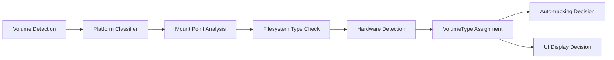

<!--CREATED: 2025-07-26-->
# Volume Classification and UX Enhancement Design

**Status:** Draft
**Author:** Spacedrive Team
**Date:** 2025-01-26
**Version:** 1.0

## Table of Contents

1. [Problem Statement](#problem-statement)
2. [Goals](#goals)
3. [Non-Goals](#non-goals)
4. [Background](#background)
5. [Design Overview](#design-overview)
6. [Detailed Design](#detailed-design)
7. [Implementation Plan](#implementation-plan)
8. [Platform Considerations](#platform-considerations)
9. [Migration Strategy](#migration-strategy)
10. [Testing Strategy](#testing-strategy)
11. [Security Considerations](#security-considerations)
12. [Alternatives Considered](#alternatives-considered)

## Problem Statement

Currently, Spacedrive auto-tracks all detected system volumes, leading to several UX issues:

### Current Problems

1. **Visual Clutter**: Users see system-internal volumes (VM, Preboot, Update, Hardware) that aren't relevant for file management
2. **Cognitive Overhead**: 13+ volumes displayed when only 3-4 are user-relevant
3. **Storage Confusion**: System volumes show capacity/usage that doesn't reflect user storage
4. **Auto-tracking Noise**: System volumes are automatically tracked, creating database bloat
5. **Cross-platform Inconsistency**: No unified approach to volume relevance across macOS, Windows, Linux

### User Impact

- **File Manager UX**: Users expect to see only their actual storage devices (like Finder, Explorer)
- **Storage Management**: Difficulty identifying which volumes contain their files
- **Performance**: Unnecessary indexing and tracking of system volumes
- **Confusion**: Technical mount points exposed to end users

## Goals

### Primary Goals

1. **Clean UX**: Show only user-relevant volumes by default
2. **Smart Auto-tracking**: Only auto-track volumes that contain user data
3. **Platform Awareness**: Understand OS-specific volume hierarchies
4. **Flexibility**: Allow power users to see/manage system volumes when needed
5. **Backwards Compatibility**: Don't break existing tracked volumes

### Secondary Goals

1. **Performance**: Reduce database size by not tracking system volumes
2. **Consistency**: Unified volume classification across platforms
3. **Extensibility**: Framework for future volume type additions
4. **User Control**: Preferences for volume display and tracking behavior

## Non-Goals

1. **File System Analysis**: Not analyzing directory contents to classify volumes
2. **Dynamic Reclassification**: Volume types are determined at detection time
3. **Custom User Categories**: Not supporting user-defined volume types in v1
4. **Volume Merging**: Not combining related volumes into single entities

## Background

### Current Architecture

```rust
// Current Volume struct (simplified)
pub struct Volume {
    pub fingerprint: VolumeFingerprint,
    pub name: String,
    pub mount_point: PathBuf,
    pub mount_type: MountType, // System, External, Network
    pub is_mounted: bool,
    // ... other fields
}

// Current auto-tracking (tracks all system volumes)
pub async fn auto_track_system_volumes(&self, library: &Library) -> VolumeResult<Vec<Model>> {
    let system_volumes = self.get_system_volumes().await; // All MountType::System
    for volume in system_volumes {
        self.track_volume(library, &volume.fingerprint, Some(volume.name.clone())).await?;
    }
}
```

### Platform Volume Hierarchies

**macOS (APFS Container Model)**

```
/ (Macintosh HD) - Primary system drive
├── /System/Volumes/Data - User data (separate volume)
├── /System/Volumes/VM - Virtual memory
├── /System/Volumes/Preboot - Boot support
├── /System/Volumes/Update - System updates
├── /System/Volumes/Hardware - Hardware support
└── /Volumes/* - External/user drives
```

**Windows**

```
C:\ - Primary system + user data
D:\, E:\, etc. - Secondary drives
Recovery partitions - System recovery
EFI System Partition - Boot system
```

**Linux**

```
/ - Root filesystem
/home - User data (often separate partition)
/boot - Boot partition
/proc, /sys, /dev - Virtual filesystems
/media/*, /mnt/* - Removable/external media
```

## Design Overview

### Core Concept: Volume Type Classification

Replace the simple `MountType` enum with a more sophisticated `VolumeType` that captures user intent and OS semantics.

```rust
#[derive(Debug, Clone, Copy, PartialEq, Eq, Serialize, Deserialize)]
pub enum VolumeType {
    Primary,    // Main system drive with user data
    UserData,   // Dedicated user data volumes
    External,   // Removable/external storage
    Secondary,  // Additional internal storage
    System,     // OS internal volumes (hidden by default)
    Network,    // Network attached storage
    Unknown,    // Fallback for unclassified
}
```

### Classification Pipeline



### UX Improvements

1. **Default View**: Show only `Primary`, `UserData`, `External`, `Secondary`, `Network`
2. **System View**: Optional flag to show `System` volumes
3. **Auto-tracking**: Only track non-`System` volumes by default
4. **Visual Indicators**: Clear type indicators in CLI/UI

## Detailed Design

### 1. Core Type Definitions

```rust
// src/volume/types.rs

/// Classification of volume types for UX and auto-tracking decisions
#[derive(Debug, Clone, Copy, PartialEq, Eq, Serialize, Deserialize)]
pub enum VolumeType {
    /// Primary system drive containing OS and user data
    /// Examples: C:\ on Windows, / on Linux, Macintosh HD on macOS
    Primary,

    /// Dedicated user data volumes (separate from OS)
    /// Examples: /System/Volumes/Data on macOS, separate /home on Linux
    UserData,

    /// External or removable storage devices
    /// Examples: USB drives, external HDDs, /Volumes/* on macOS
    External,

    /// Secondary internal storage (additional drives/partitions)
    /// Examples: D:, E: drives on Windows, additional mounted drives
    Secondary,

    /// System/OS internal volumes (hidden from normal view)
    /// Examples: /System/Volumes/* on macOS, Recovery partitions
    System,

    /// Network attached storage
    /// Examples: SMB mounts, NFS, cloud storage
    Network,

    /// Unknown or unclassified volumes
    Unknown,
}

impl VolumeType {
    /// Should this volume type be auto-tracked by default?
    pub fn auto_track_by_default(&self) -> bool {
        match self {
            VolumeType::Primary | VolumeType::UserData
            | VolumeType::External | VolumeType::Secondary
            | VolumeType::Network => true,
            VolumeType::System | VolumeType::Unknown => false,
        }
    }

    /// Should this volume be shown in the default UI view?
    pub fn show_by_default(&self) -> bool {
        !matches!(self, VolumeType::System | VolumeType::Unknown)
    }

    /// User-friendly display name for the volume type
    pub fn display_name(&self) -> &'static str {
        match self {
            VolumeType::Primary => "Primary Drive",
            VolumeType::UserData => "User Data",
            VolumeType::External => "External Drive",
            VolumeType::Secondary => "Secondary Drive",
            VolumeType::System => "System Volume",
            VolumeType::Network => "Network Drive",
            VolumeType::Unknown => "Unknown",
        }
    }

    /// Icon/indicator for CLI display
    pub fn icon(&self) -> &'static str {
        match self {
            VolumeType::Primary => "[PRI]",
            VolumeType::UserData => "[USR]",
            VolumeType::External => "[EXT]",
            VolumeType::Secondary => "[SEC]",
            VolumeType::System => "[SYS]",
            VolumeType::Network => "[NET]",
            VolumeType::Unknown => "[UNK]",
        }
    }
}

/// Enhanced volume information with classification
pub struct Volume {
    // ... existing fields ...

    /// Classification of this volume for UX decisions
    pub volume_type: VolumeType,

    /// Whether this volume should be visible in default views
    pub is_user_visible: bool,

    /// Whether this volume should be auto-tracked
    pub auto_track_eligible: bool,
}
```

### 2. Platform-Specific Classification

```rust
// src/volume/classification.rs

pub trait VolumeClassifier {
    fn classify(&self, volume_info: &VolumeDetectionInfo) -> VolumeType;
}

pub struct MacOSClassifier;
impl VolumeClassifier for MacOSClassifier {
    fn classify(&self, info: &VolumeDetectionInfo) -> VolumeType {
        let mount_str = info.mount_point.to_string_lossy();

        match mount_str.as_ref() {
            // Primary system drive
            "/" => VolumeType::Primary,

            // User data volume (modern macOS separates this)
            path if path.starts_with("/System/Volumes/Data") => VolumeType::UserData,

            // System internal volumes
            path if path.starts_with("/System/Volumes/") => VolumeType::System,

            // External drives
            path if path.starts_with("/Volumes/") => {
                if info.is_removable.unwrap_or(false) {
                    VolumeType::External
                } else {
                    // Could be user-created APFS volume
                    VolumeType::Secondary
                }
            },

            // Network mounts
            path if path.starts_with("/Network/") => VolumeType::Network,

            // macOS autofs system
            path if mount_str.contains("auto_home") ||
                    info.file_system == FileSystem::Other("autofs".to_string()) => VolumeType::System,

            _ => VolumeType::Unknown,
        }
    }
}

pub struct WindowsClassifier;
impl VolumeClassifier for WindowsClassifier {
    fn classify(&self, info: &VolumeDetectionInfo) -> VolumeType {
        let mount_str = info.mount_point.to_string_lossy();

        match mount_str.as_ref() {
            // Primary system drive (usually C:)
            "C:\\" => VolumeType::Primary,

            // Recovery and EFI partitions
            path if path.contains("Recovery")
                 || path.contains("EFI")
                 || info.file_system == FileSystem::Fat32 && info.total_bytes_capacity < 1_000_000_000 => {
                VolumeType::System
            },

            // Other drive letters
            path if path.len() == 3 && path.ends_with(":\\") => {
                if info.is_removable.unwrap_or(false) {
                    VolumeType::External
                } else {
                    VolumeType::Secondary
                }
            },

            // Network drives
            path if path.starts_with("\\\\") => VolumeType::Network,

            _ => VolumeType::Unknown,
        }
    }
}

pub struct LinuxClassifier;
impl VolumeClassifier for LinuxClassifier {
    fn classify(&self, info: &VolumeDetectionInfo) -> VolumeType {
        let mount_str = info.mount_point.to_string_lossy();

        match mount_str.as_ref() {
            // Root filesystem
            "/" => VolumeType::Primary,

            // User data partition
            "/home" => VolumeType::UserData,

            // System/virtual filesystems
            path if path.starts_with("/proc")
                 || path.starts_with("/sys")
                 || path.starts_with("/dev")
                 || path.starts_with("/boot") => VolumeType::System,

            // External/removable media
            path if path.starts_with("/media/")
                 || path.starts_with("/mnt/")
                 || info.is_removable.unwrap_or(false) => VolumeType::External,

            // Network mounts
            path if info.file_system == FileSystem::Other("nfs".to_string())
                 || info.file_system == FileSystem::Other("cifs".to_string()) => VolumeType::Network,

            _ => VolumeType::Secondary,
        }
    }
}

pub fn get_classifier() -> Box<dyn VolumeClassifier> {
    #[cfg(target_os = "macos")]
    return Box::new(MacOSClassifier);

    #[cfg(target_os = "windows")]
    return Box::new(WindowsClassifier);

    #[cfg(target_os = "linux")]
    return Box::new(LinuxClassifier);

    #[cfg(not(any(target_os = "macos", target_os = "windows", target_os = "linux")))]
    return Box::new(UnknownClassifier);
}
```

### 3. Updated Volume Detection

```rust
// src/volume/os_detection.rs

pub async fn detect_volumes(device_id: Uuid) -> VolumeResult<Vec<Volume>> {
    let classifier = classification::get_classifier();
    let raw_volumes = detect_raw_volumes().await?;

    let mut volumes = Vec::new();
    for raw_volume in raw_volumes {
        let volume_type = classifier.classify(&raw_volume);

        let volume = Volume {
            fingerprint: VolumeFingerprint::new(device_id, &raw_volume),
            device_id,
            name: raw_volume.name,
            volume_type,
            mount_type: determine_mount_type(&volume_type),
            mount_point: raw_volume.mount_point,
            is_user_visible: volume_type.show_by_default(),
            auto_track_eligible: volume_type.auto_track_by_default(),
            // ... other fields
        };

        volumes.push(volume);
    }

    Ok(volumes)
}
```

### 4. Enhanced Auto-tracking Logic

```rust
// src/volume/manager.rs

impl VolumeManager {
    /// Auto-track user-relevant volumes only
    pub async fn auto_track_user_volumes(
        &self,
        library: &crate::library::Library,
    ) -> VolumeResult<Vec<entities::volume::Model>> {
        let eligible_volumes: Vec<_> = self.volumes
            .read()
            .await
            .values()
            .filter(|v| v.auto_track_eligible)
            .cloned()
            .collect();

        let mut tracked_volumes = Vec::new();

        info!(
            "Auto-tracking {} user-relevant volumes for library '{}'",
            eligible_volumes.len(),
            library.name().await
        );

        for volume in eligible_volumes {
            // Skip if already tracked
            if self.is_volume_tracked(library, &volume.fingerprint).await? {
                debug!("Volume '{}' ({:?}) already tracked in library",
                       volume.name, volume.volume_type);
                continue;
            }

            match self.track_volume(library, &volume.fingerprint, Some(volume.name.clone())).await {
                Ok(tracked) => {
                    info!(
                        "Auto-tracked {} volume '{}' in library '{}'",
                        volume.volume_type.display_name(),
                        volume.name,
                        library.name().await
                    );
                    tracked_volumes.push(tracked);
                }
                Err(e) => {
                    warn!(
                        "Failed to auto-track {} volume '{}': {}",
                        volume.volume_type.display_name(),
                        volume.name,
                        e
                    );
                }
            }
        }

        Ok(tracked_volumes)
    }

    /// Get volumes filtered by type and visibility
    pub async fn get_user_visible_volumes(&self) -> Vec<Volume> {
        self.volumes
            .read()
            .await
            .values()
            .filter(|v| v.is_user_visible)
            .cloned()
            .collect()
    }

    /// Get all volumes including system volumes
    pub async fn get_all_volumes_with_system(&self) -> Vec<Volume> {
        self.volumes.read().await.values().cloned().collect()
    }
}
```

### 5. Enhanced CLI Interface

```rust
// src/infrastructure/cli/commands/volume.rs

#[derive(Debug, Clone, Subcommand, Serialize, Deserialize)]
pub enum VolumeCommands {
    /// List volumes (user-visible by default)
    List {
        /// Include system volumes in output
        #[arg(long)]
        include_system: bool,

        /// Filter by volume type
        #[arg(long, value_enum)]
        type_filter: Option<VolumeTypeFilter>,

        /// Show volume type column
        #[arg(long)]
        show_types: bool,
    },
    // ... other commands
}

#[derive(Debug, Clone, ValueEnum, Serialize, Deserialize)]
pub enum VolumeTypeFilter {
    Primary,
    UserData,
    External,
    Secondary,
    System,
    Network,
    Unknown,
}

// Enhanced volume list formatting
fn format_volume_list(
    volumes: Vec<Volume>,
    tracked_info: HashMap<VolumeFingerprint, TrackedVolume>,
    show_types: bool,
    include_system: bool,
) -> comfy_table::Table {
    let mut table = Table::new();

    if show_types {
        table.set_header(vec!["Type", "Name", "Mount Point", "File System", "Capacity", "Available", "Status", "Tracked"]);
    } else {
        table.set_header(vec!["Name", "Mount Point", "File System", "Capacity", "Available", "Status", "Tracked"]);
    }

    let filtered_volumes: Vec<_> = volumes.into_iter()
        .filter(|v| include_system || v.is_user_visible)
        .collect();

    for volume in filtered_volumes {
        let tracked_status = if let Some(tracked) = tracked_info.get(&volume.fingerprint) {
            format!("Yes ({})", tracked.display_name.as_deref().unwrap_or(&volume.name))
        } else {
            "No".to_string()
        };

        let mut row = Vec::new();

        if show_types {
            row.push(format!("{} {}", volume.volume_type.icon(), volume.volume_type.display_name()));
        }

        row.extend([
            volume.name,
            volume.mount_point.display().to_string(),
            volume.file_system.to_string(),
            format_bytes(volume.total_bytes_capacity),
            format_bytes(volume.total_bytes_available),
            if volume.is_mounted { "Mounted" } else { "Unmounted" }.to_string(),
            tracked_status,
        ]);

        table.add_row(row);
    }

    table
}
```

### 6. Database Schema Updates

```rust
// Add volume_type to database schema
// src/infrastructure/database/entities/volume.rs

#[derive(Clone, Debug, PartialEq, DeriveEntityModel, Eq)]
#[sea_orm(table_name = "volumes")]
pub struct Model {
    // ... existing fields ...

    /// Volume type classification
    pub volume_type: String, // Serialized VolumeType

    /// Whether volume is visible in default UI
    pub is_user_visible: Option<bool>,

    /// Whether volume is eligible for auto-tracking
    pub auto_track_eligible: Option<bool>,
}

// Migration to add new columns
// src/infrastructure/database/migration/m20250126_000001_add_volume_classification.rs
```

## Implementation Plan

### Phase 1: Core Classification (Week 1)

- [ ] Add `VolumeType` enum and classification traits
- [ ] Implement platform-specific classifiers
- [ ] Update `Volume` struct with new fields
- [ ] Add database migration for new fields

### Phase 2: Volume Detection Integration (Week 1)

- [ ] Update volume detection to use classifiers
- [ ] Modify auto-tracking logic to respect `auto_track_eligible`
- [ ] Update volume manager methods
- [ ] Add comprehensive tests for classification

### Phase 3: CLI Enhancement (Week 2)

- [ ] Add CLI flags for system volume display
- [ ] Enhance volume list formatting with types
- [ ] Add volume type filtering options
- [ ] Update help text and documentation

### Phase 4: Migration and Testing (Week 2)

- [ ] Create migration script for existing volumes
- [ ] Add integration tests across platforms
- [ ] Performance testing with large volume sets
- [ ] User acceptance testing

### Phase 5: Advanced Features (Future)

- [ ] User preferences for volume display
- [ ] Custom volume type rules
- [ ] Volume grouping/organization
- [ ] Integration with file manager UI

## Platform Considerations

### macOS Specifics

- **APFS Containers**: Multiple volumes in single container
- **System Volume Group**: Related system volumes
- **Sealed System Volume**: Read-only system partition
- **Data Volume**: Separate user data volume

### Windows Specifics

- **Drive Letters**: Single-letter mount points
- **Hidden Partitions**: Recovery, EFI partitions
- **Dynamic Disks**: Spanned/striped volumes
- **Junction Points**: Directory-level mounts

### Linux Specifics

- **Virtual Filesystems**: /proc, /sys, /dev
- **Bind Mounts**: Same filesystem at multiple points
- **Network Filesystems**: NFS, CIFS, SSHFS
- **Container Filesystems**: Docker, LXC volumes

## Migration Strategy

### Existing Volume Handling

1. **Backward Compatibility**: Existing tracked volumes remain tracked
2. **Gradual Migration**: Classify existing volumes on next refresh
3. **Default Behavior**: System volumes stop auto-tracking for new libraries
4. **User Choice**: Allow users to manually track/untrack any volume

### Database Migration

```sql
-- Add new columns with defaults
ALTER TABLE volumes ADD COLUMN volume_type TEXT DEFAULT 'Unknown';
ALTER TABLE volumes ADD COLUMN is_user_visible BOOLEAN DEFAULT true;
ALTER TABLE volumes ADD COLUMN auto_track_eligible BOOLEAN DEFAULT true;

-- Backfill existing volumes based on mount_point patterns
UPDATE volumes SET volume_type = 'System'
WHERE mount_point LIKE '/System/Volumes/%' AND mount_point != '/System/Volumes/Data';

UPDATE volumes SET volume_type = 'External'
WHERE mount_point LIKE '/Volumes/%';

UPDATE volumes SET volume_type = 'Primary'
WHERE mount_point = '/';
```

## Testing Strategy

### Unit Tests

- Platform classifier logic
- Volume type determination
- Auto-tracking eligibility
- UI filtering logic

### Integration Tests

- Volume detection with classification
- Auto-tracking behavior changes
- CLI output formatting
- Database migration

### Platform Tests

- macOS system volume detection
- Windows drive letter handling
- Linux virtual filesystem filtering
- Cross-platform consistency

### Performance Tests

- Volume detection with classification overhead
- Database query performance with new indexes
- Memory usage with additional volume metadata

## Security Considerations

### Information Disclosure

- **System Volume Exposure**: Hiding system volumes reduces information leakage
- **Mount Point Sanitization**: Ensure mount paths don't expose sensitive info
- **Volume Enumeration**: Limit volume discovery to accessible mounts

### Access Control

- **Permission Checks**: Verify read access before classifying volumes
- **Privilege Escalation**: Don't require elevated permissions for classification
- **User Context**: Classify volumes based on current user's perspective

## Alternatives Considered

### 1. Configuration-Based Classification

**Approach**: User-defined rules for volume classification
**Pros**: Fully customizable, handles edge cases
**Cons**: Complex setup, inconsistent defaults, maintenance burden
**Decision**: Rejected - Too complex for initial implementation

### 2. Content-Based Classification

**Approach**: Analyze directory contents to determine volume purpose
**Pros**: More accurate classification, adapts to user behavior
**Cons**: Performance overhead, privacy concerns, complexity
**Decision**: Rejected - Out of scope for v1, privacy issues

### 3. Simple Blacklist/Whitelist

**Approach**: Hard-coded lists of paths to show/hide
**Pros**: Simple implementation, predictable behavior
**Cons**: Brittle, platform-specific, hard to maintain
**Decision**: Rejected - Not flexible enough, maintenance nightmare

### 4. No Classification (Status Quo)

**Approach**: Keep current behavior, show all volumes
**Pros**: No implementation effort, backward compatible
**Cons**: Poor UX, cluttered interface, user confusion
**Decision**: Rejected - UX problems too significant

## Success Metrics

### User Experience

- **Volume Count Reduction**: 50%+ reduction in default volume list
- **User Comprehension**: A/B testing shows improved understanding
- **Support Requests**: Fewer volume-related confusion tickets

### Technical Metrics

- **Classification Accuracy**: 95%+ correct volume type assignment
- **Performance Impact**: <10ms additional detection overhead
- **Database Size**: Reduced tracking overhead for system volumes

### Adoption Metrics

- **CLI Usage**: Increased usage of volume commands
- **Feature Discovery**: Users find relevant volumes faster
- **System Volume Access**: <5% users need `--include-system` flag

---

## Appendix: Example Outputs

### Before (Current)

```bash
$ sd volume list
┌──────────────┬─────────────────────────────────┬─────────────┬──────────┬───────────┬─────────┬─────────────────┐
│ Name         │ Mount Point                     │ File System │ Capacity │ Available │ Status  │ Tracked         │
├──────────────┼─────────────────────────────────┼─────────────┼──────────┼───────────┼─────────┼─────────────────┤
│ Samsung      │ /Volumes/Samsung                │ Unknown     │ 2.0 TB   │ 301.0 GB  │ Mounted │ No              │
│ mnt1         │ /System/Volumes/Update/SFR/mnt1 │ APFS        │ 5.2 GB   │ 3.3 GB    │ Mounted │ Yes (mnt1)      │
│ iSCPreboot   │ /System/Volumes/iSCPreboot      │ APFS        │ 524.0 MB │ 502.0 MB  │ Mounted │ Yes (iSCPreboot)│
│ Preboot      │ /System/Volumes/Preboot         │ APFS        │ 990.0 GB │ 3.3 GB    │ Mounted │ Yes (Preboot)   │
│ xarts        │ /System/Volumes/xarts           │ APFS        │ 524.0 MB │ 502.0 MB  │ Mounted │ Yes (xarts)     │
│ Untitled     │ /Volumes/Untitled               │ APFS        │ 995.0 GB │ 8.2 GB    │ Mounted │ No              │
│ Hardware     │ /System/Volumes/Hardware        │ APFS        │ 524.0 MB │ 502.0 MB  │ Mounted │ Yes (Hardware)  │
│ -            │ -                               │ Unknown     │ Unknown  │ Unknown   │ Mounted │ Yes (-)         │
│ VM           │ /System/Volumes/VM              │ APFS        │ 990.0 GB │ 3.3 GB    │ Mounted │ Yes (VM)        │
│ Data         │ /System/Volumes/Data            │ APFS        │ 990.0 GB │ 3.3 GB    │ Mounted │ Yes (Data)      │
│ mnt1         │ /System/Volumes/Update/mnt1     │ APFS        │ 990.0 GB │ 3.3 GB    │ Mounted │ Yes (mnt1)      │
│ Macintosh HD │ /                               │ APFS        │ 990.0 GB │ 3.3 GB    │ Mounted │ Yes (Macintosh) │
│ Update       │ /System/Volumes/Update          │ APFS        │ 990.0 GB │ 3.3 GB    │ Mounted │ Yes (Update)    │
└──────────────┴─────────────────────────────────┴─────────────┴──────────┴───────────┴─────────┴─────────────────┘
13 volumes found
```

### After (Proposed Default)

```bash
$ sd volume list
┌──────────────┬─────────────────┬─────────────┬──────────┬───────────┬─────────┬─────────────────┐
│ Name         │ Mount Point     │ File System │ Capacity │ Available │ Status  │ Tracked         │
├──────────────┼─────────────────┼─────────────┼──────────┼───────────┼─────────┼─────────────────┤
│ Macintosh HD │ /               │ APFS        │ 990.0 GB │ 3.3 GB    │ Mounted │ Yes (Macintosh) │
│ Data         │ /System/.../Data│ APFS        │ 990.0 GB │ 3.3 GB    │ Mounted │ Yes (Data)      │
│ Samsung      │ /Volumes/Samsung│ Unknown     │ 2.0 TB   │ 301.0 GB  │ Mounted │ No              │
│ Untitled     │ /Volumes/Untitled│ APFS       │ 995.0 GB │ 8.2 GB    │ Mounted │ No              │
└──────────────┴─────────────────┴─────────────┴──────────┴───────────┴─────────┴─────────────────┘
4 volumes found (9 system volumes hidden, use --include-system to show)
```

### After (With System Volumes)

```bash
$ sd volume list --include-system --show-types
┌─────────────────────┬──────────────┬─────────────────────────────────┬─────────────┬──────────┬───────────┬─────────┬─────────────────┐
│ Type                │ Name         │ Mount Point                     │ File System │ Capacity │ Available │ Status  │ Tracked         │
├─────────────────────┼──────────────┼─────────────────────────────────┼─────────────┼──────────┼───────────┼─────────┼─────────────────┤
│ [PRI] Primary Drive │ Macintosh HD │ /                               │ APFS        │ 990.0 GB │ 3.3 GB    │ Mounted │ Yes (Macintosh) │
│ [USR] User Data     │ Data         │ /System/Volumes/Data            │ APFS        │ 990.0 GB │ 3.3 GB    │ Mounted │ Yes (Data)      │
│ [EXT] External Drive│ Samsung      │ /Volumes/Samsung                │ Unknown     │ 2.0 TB   │ 301.0 GB  │ Mounted │ No              │
│ [SEC] Secondary Drive│ Untitled     │ /Volumes/Untitled               │ APFS        │ 995.0 GB │ 8.2 GB    │ Mounted │ No              │
│ [SYS] System Volume │ VM           │ /System/Volumes/VM              │ APFS        │ 990.0 GB │ 3.3 GB    │ Mounted │ No              │
│ [SYS] System Volume │ Preboot      │ /System/Volumes/Preboot         │ APFS        │ 990.0 GB │ 3.3 GB    │ Mounted │ No              │
│ [SYS] System Volume │ Update       │ /System/Volumes/Update          │ APFS        │ 990.0 GB │ 3.3 GB    │ Mounted │ No              │
│ [SYS] System Volume │ Hardware     │ /System/Volumes/Hardware        │ APFS        │ 524.0 MB │ 502.0 MB  │ Mounted │ No              │
│ [SYS] System Volume │ iSCPreboot   │ /System/Volumes/iSCPreboot      │ APFS        │ 524.0 MB │ 502.0 MB  │ Mounted │ No              │
│ [SYS] System Volume │ xarts        │ /System/Volumes/xarts           │ APFS        │ 524.0 MB │ 502.0 MB  │ Mounted │ No              │
│ [SYS] System Volume │ mnt1         │ /System/Volumes/Update/mnt1     │ APFS        │ 990.0 GB │ 3.3 GB    │ Mounted │ No              │
│ [SYS] System Volume │ mnt1         │ /System/Volumes/Update/SFR/mnt1 │ APFS        │ 5.2 GB   │ 3.3 GB    │ Mounted │ No              │
│ [UNK] Unknown       │ -            │ -                               │ Unknown     │ Unknown  │ Unknown   │ Mounted │ No              │
└─────────────────────┴──────────────┴─────────────────────────────────┴─────────────┴──────────┴───────────┴─────────┴─────────────────┘
13 volumes found
```
