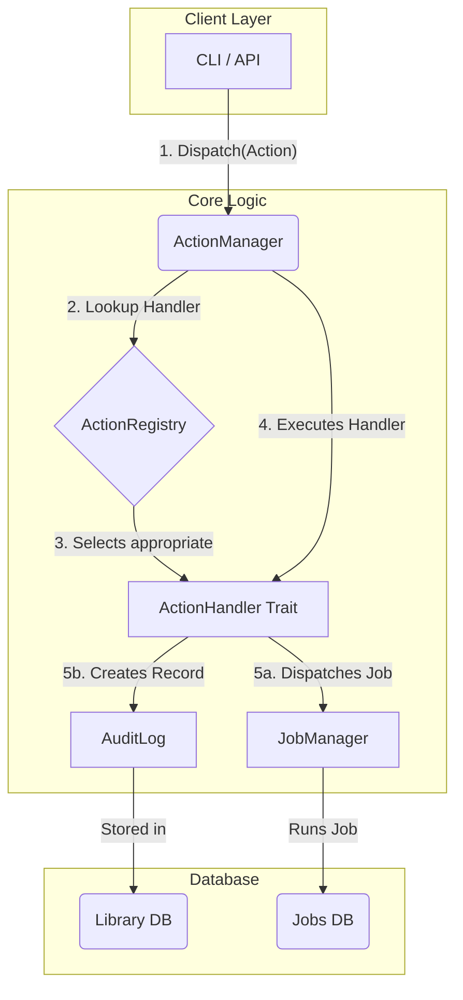

<!--CREATED: 2025-07-02-->
Of course. Here is the revised design document, incorporating the more modular Action Handler pattern and a clear explanation of how parameters are passed into the system.

---

# Design Document: Action System & Audit Log (Revision 2)

This document outlines the design for a new **Action System** and **Audit Log**. This system introduces a centralized, robust, and extensible layer for handling all user-initiated operations, serving as the primary integration point for the CLI and future APIs. This revised design prioritizes modularity and scalability.

---

## 1\. High-Level Architecture

The architecture is built around a central **`ActionManager`** that acts as a router. Client requests are translated into a specific `Action` enum and dispatched. The manager then uses a **`ActionRegistry`** to find the appropriate **`ActionHandler`** to execute the logic. This ensures that each action's implementation is self-contained.

Every action dispatched, whether it's a long-running job or an immediate operation, creates an entry in the **`AuditLog`** to provide a clean, user-facing history of events.

### Data and Logic Flow



---

## 2\. The Action System

The Action System is designed to be highly modular to accommodate future growth. [cite\_start]It avoids a single, monolithic `match` statement by using a trait-based handler pattern, similar to the existing `JobRegistry`[cite: 2259].

It will live in a new module: **`src/operations/actions/`**.

### The `Action` Enum

This enum defines the "what" of an operation. It's a type-safe contract between the client layer and the core.

**File: `src/operations/actions/mod.rs`**

```rust
use crate::shared::types::SdPath;
use serde::{Deserialize, Serialize};
use std::path::PathBuf;
use uuid::Uuid;

// ... Action-specific option structs (CopyOptions, DeleteOptions, etc.)

/// Represents a user-initiated action within Spacedrive.
#[derive(Debug, Clone, Serialize, Deserialize)]
pub enum Action {
    // Job-based actions
    FileCopy {
        sources: Vec<SdPath>,
        destination: SdPath,
        options: CopyOptions,
    },

    // Direct (non-job) actions
    LibraryCreate {
        name: String,
        path: Option<PathBuf>,
    },

    // Hybrid actions (direct action that dispatches a job)
    LocationAdd {
        library_id: Uuid,
        path: PathBuf,
        name: Option<String>,
        mode: IndexMode, // Assuming IndexMode enum exists
    },
}

impl Action {
    /// Returns a string identifier for the action type.
    pub fn kind(&self) -> &'static str {
        match self {
            Action::FileCopy { .. } => "file.copy",
            Action::LibraryCreate { .. } => "library.create",
            Action::LocationAdd { .. } => "location.add",
        }
    }
}
```

### The Action Handler Pattern

To ensure scalability, each action's logic is encapsulated in its own handler.

#### a. `ActionHandler` Trait

This trait defines the contract for all action handlers.

**File: `src/operations/actions/handler.rs`**

```rust
#[async_trait]
pub trait ActionHandler: Send + Sync {
    /// Executes the action.
    async fn execute(&self, context: Arc<CoreContext>, action: Action) -> Result<ActionReceipt, ActionError>;
}
```

#### b. Concrete Handler Implementation

Here is an example for a direct, non-job action.

**File: `src/operations/actions/handlers/library_create.rs`**

```rust
pub struct LibraryCreateHandler;

#[async_trait]
impl ActionHandler for LibraryCreateHandler {
    async fn execute(&self, context: Arc<CoreContext>, action: Action) -> Result<ActionReceipt, ActionError> {
        if let Action::LibraryCreate { name, path } = action {
            let library_manager = &context.library_manager;
            let new_library = library_manager.create_library(name, path).await?;

            Ok(ActionReceipt {
                job_handle: None, // No job was created
                result_payload: Some(serde_json::json!({ "library_id": new_library.id() })),
            })
        } else {
            Err(ActionError::InvalidActionType)
        }
    }
}
```

### The `ActionManager` and `ActionRegistry`

The `ActionManager` becomes a simple router. [cite\_start]It uses an `ActionRegistry` (which would be populated automatically using the `inventory` crate, just like the `JobRegistry` [cite: 2259]) to find and execute the correct handler.

**File: `src/operations/actions/manager.rs`**

```rust
pub struct ActionManager {
    context: Arc<CoreContext>,
    registry: ActionRegistry, // Contains HashMap of action "kind" -> handler
}

impl ActionManager {
    pub async fn dispatch(&self, library_id: Uuid, action: Action) -> Result<ActionReceipt, ActionError> {
        // 1. (Future) Permissions check would go here

        // 2. Find the correct handler in the registry
        let handler = self.registry.get(action.kind())
            .ok_or(ActionError::ActionNotRegistered)?;

        // 3. Create the initial AuditLog entry
        let audit_entry = self.create_audit_log(library_id, &action).await?;

        // 4. Execute the handler
        let result = handler.execute(self.context.clone(), action).await;

        // 5. Update the audit log with the final status and return
        self.finalize_audit_log(audit_entry, &result).await?;
        result
    }

    // ... private helper methods ...
}
```

---

## 3\. The Audit Log Data Model

The `AuditLog` provides a high-level, human-readable history of actions. It is stored in the library's main database.

**File: `src/infrastructure/database/entities/audit_log.rs`**

```rust
use sea_orm::entity::prelude::*;
use serde::{Deserialize, Serialize};

#[derive(Clone, Debug, PartialEq, Eq, DeriveEntityModel, Serialize, Deserialize)]
#[sea_orm(table_name = "audit_log")]
pub struct Model {
    #[sea_orm(primary_key)]
    pub id: i32,
    #[sea_orm(unique)]
    pub uuid: Uuid,

    #[sea_orm(indexed)]
    pub action_type: String,

    #[sea_orm(indexed)]
    pub actor_device_id: Uuid,

    #[sea_orm(column_type = "Json")]
    pub targets: Json, // Summary of action targets

    #[sea_orm(indexed)]
    pub status: ActionStatus,

    // This is optional because not all actions create jobs.
    #[sea_orm(indexed, nullable)]
    pub job_id: Option<Uuid>,

    pub created_at: DateTimeUtc,
    pub completed_at: Option<DateTimeUtc>,
}

#[derive(Debug, Clone, PartialEq, Eq, EnumIter, DeriveActiveEnum, Serialize, Deserialize)]
#[sea_orm(rs_type = "String", db_type = "Text")]
pub enum ActionStatus {
    #[sea_orm(string_value = "in_progress")]
    InProgress,
    #[sea_orm(string_value = "completed")]
    Completed,
    #[sea_orm(string_value = "failed")]
    Failed,
}

// ... Relations and ActiveModelBehavior ...
```

A new database migration will be added to create this table.

---

## 4\. Client Integration & Parameter Handling

A key responsibility of the client layer (CLI, API) is to translate raw user input into the strongly-typed `Action` enum.

Here is the data flow for passing parameters like `SdPathBatch`:

1.  **User Input**: The user provides raw strings to the client.

    ```bash
    spacedrive copy "/path/to/fileA.txt" "/path/to/fileB.txt" --dest "/path/to/destination/"
    ```

2.  **CLI/API Parsing**: The client's argument parser (`clap` for the CLI) converts these strings into basic Rust types (`Vec<PathBuf>`).

3.  **Command Handler Logic**: The handler function (e.g., in `src/infrastructure/cli/commands.rs`) converts these basic types into the rich domain types required by the `Action`.

    **`src/infrastructure/cli/commands.rs`**

    ```rust
    async fn handle_copy_command(
        action_manager: &ActionManager,
        library_id: Uuid,
        source_paths: Vec<PathBuf>, // <-- from clap
        dest_path: PathBuf,        // <-- from clap
    ) -> Result<()> {

        // 1. Convert local paths into `SdPath` objects.
        let sd_sources: Vec<SdPath> = source_paths
            .into_iter()
            [cite_start].map(SdPath::local) // Creates an SdPath with the current device's ID [cite: 515]
            .collect();

        // 2. Construct the final, strongly-typed Action enum.
        let copy_action = Action::FileCopy {
            sources: sd_sources,
            destination: SdPath::local(dest_path),
            options: CopyOptions::default(),
        };

        // 3. Dispatch the complete Action object.
        match action_manager.dispatch(library_id, copy_action).await {
            Ok(receipt) => { /* ... */ },
            Err(e) => { /* ... */ },
        }

        Ok(())
    }
    ```

This process ensures that the core `ActionManager` always receives a valid, type-safe `Action`, and the client layer handles the responsibility of parsing and validation.
