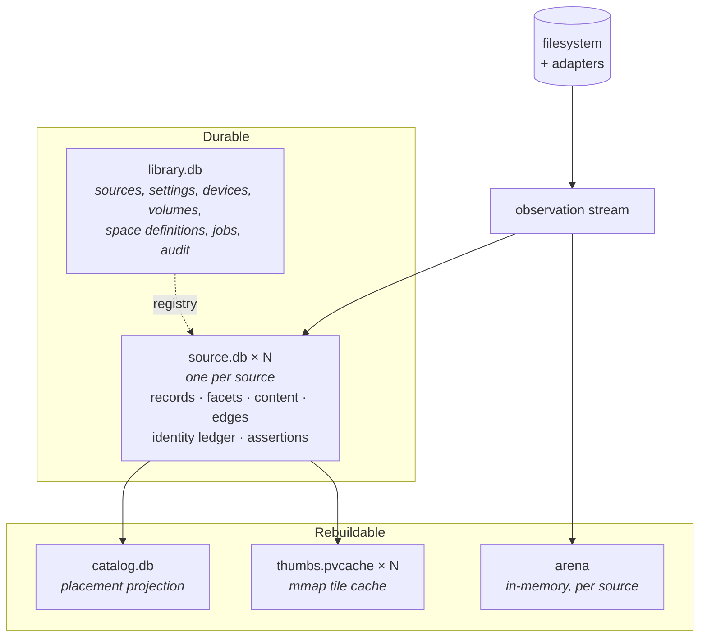

# Spacedrive Architecture — Previs

> Written as if the entries teardown is complete. Present tense throughout, as
> though describing a system that exists. It does not. This is the target,
> written down so it can be argued with before it is built.
>
> Where the design makes a choice that could reasonably go the other way, the
> choice is marked **[decision]** and restated at the end. Where something is
> genuinely unresolved it is marked **[open]** rather than papered over.

## The shape

One daemon owns everything. Clients — CLI, Tauri, web, native — connect over a
unix socket or websocket and speak JSON-RPC against a registry of ops. Nothing
below the daemon is reachable from a client, and the daemon holds no file rows
of its own.

Storage is five tiers, three durable and two rebuildable:

The direction of that graph is the whole design. Observation flows outward from
the filesystem, each tier below is derived from the one above, and every derived
tier can be deleted and rebuilt without losing anything a person typed.

## What a source is

A source is a registered root that owns an index. A physical filesystem, an
external drive, a subtree someone explicitly added, or an adapter-backed archive
like a Photos library. Sources replace Locations, which no longer exist as a
concept anywhere in the system.

The differences that matter:

- **A source is discovered, not declared.** Mounting a drive registers it.
  There is no "add location" step, no modal, and no configuration required
  before browsing works.
- **A source is identified by fingerprint, not path.** A drive that returns at
  a different mount point is the same source. A different drive at a familiar
  mount point is a different source. Path is a current fact about a source, not
  its identity.
- **A source is a transaction boundary.** One source, one database file, one
  set of guarantees. Unplugging a drive removes an index from the read set; it
  cannot leave a half-written row in anyone else's.
- **What a Location used to carry — enrichment policy — is now a property of a
  subtree.** Policy rows in `source.db` key on (source, subtree), so "hash
  everything under Photos, leave Downloads alone" is expressible without a
  Location existing to hang it from.

`library.db` holds the registry: which sources exist, their roots, their record
counts, a nullable `volume_uuid` pointing at the medium underneath, and the
origin's availability (`live`, `degraded`, `lost`). It holds no rows about
files.

Availability is what reclaim, delete, backup and sync all read, because it is
the only place that knows whether a store is the last copy of what it holds.
`docs/core/design/source-durability.md` carries it.

**A source is not a volume.** A volume is a device fact — capacity, filesystem,
speed, removable, online, which machine — true whether or not anything is
indexed. A source is an index fact. One volume hosts any number of sources
(nested roots are ordinary), and adapter, cloud and fingerprint-less network
sources have no volume at all. The fields split along that line, which is what
lets attachment stop being guessed: a source is attached when its volume is
online and its root resolves under that volume's current mount point. Nothing
stats a path to find out whether a drive is present.

## The five tiers

**`library.db`** — small, durable, one per library. Source registry, settings,
devices, volumes, space definitions, spaces, jobs, audit log, cloud credentials,
and the local presentation of tags: pinned sidebar entries, ordering, color
overrides, and definitions not yet applied anywhere. Tag definitions themselves
live in the sources that use them (`docs/core/design/tags-and-assertions.md`).
It is the only store that survives a full reindex untouched, and it is small
enough to back up as a single file. It contains no file rows, no paths, and no
content hashes.

**`source.db`** — one per source. Holds the rebuildable generation (records,
facets, FTS, content, edges) and the durable layer (identity ledger, assertions)
in one file, so a batch of observations and the watermark that records them
commit or fail together. **[decision]** — see the end.

**`catalog.db`** — a projection, swept from source stores. Global enumeration
and placement rows: which content lives on which source, at what path, last seen
when. It answers the questions no single source can — alternates, redundancy,
at-risk, search across a drive that is currently in a drawer. It is authoritative
about nothing. Delete it and it rebuilds.

**The arena** — in-memory, per source, the hot read tier. A packed node arena
with a name trie, size rollups maintained incrementally, and snapshot
persistence per source. Every path-scoped read serves from here. It is what
makes browsing feel instant on a drive that has never been indexed.

**`thumbs.pvcache`** — one mmap tile cache per source, written by the daemon's
bake chain and read by clients directly. The native app maps it; DOM clients get
cells encoded over `/hot-thumb/:source_id/:record_uuid`. Grids never touch a
database to draw.

Slots are keyed by record uuid and a version derived from size and mtime, so a
tile needs no content hash — which is what lets a drive show thumbnails the first
time it is browsed. Frames are stored packed at their true aspect with their
dimensions in the slot header, never letterboxed: square presentations are a
crop at render time, so one bake serves every surface and no background color is
ever baked into a tile.

## Identity

Three different things need identifying, and each gets the strategy that fits it.
Conflating any two of them is how file managers get identity wrong.

**Content is a value.** Immutable and self-describing. Its identity *is* its
bytes, so the id is derived from the bytes and never assigned:
`uuid_for(hash) = v5(CONTENT_NAMESPACE, hash)`. The `content` table in each
source carries that uuid alongside the hash, and `sampled_hash` is UNIQUE, so
one set of bytes is one row. Content ids are convergent —
two machines that have never communicated compute the same id for the same
bytes, offline, retroactively, with no coordination and no clock. This is what
makes `SdPath::Content { content_id }` a real address rather than a local
handle, and what lets a drive out of a drawer for five years still dedup
correctly against a laptop it has never met.

The hash is a ladder. `sampled_hash` is cheap and probabilistic;
`integrity_hash` covers every byte. A content id derived from a sampled hash is a
*candidate*; one derived from an integrity hash is *confirmed*. The distinction
is carried in the type, not in a comment, because the rules in "Trust" below
depend on it.

**A record is an entity.** A file keeps its identity through rename, move, and
edit — every attribute can change and it is still the same thing. So record ids
are assigned (`uuid v7`, time-ordered) and then *rebound by evidence*. The
identity ledger stores evidence tuples — inode, size, mtime, content hash,
parent, name — and rebinding requires at least two factors to agree. This is
what makes a tag survive a reindex: the generation is rebuilt from scratch,
fresh rows appear, and the ledger recognises them as the records that already
had names.

Two files with identical bytes are one content and two records. One file renamed
is one record and one content. Neither id substitutes for the other.

**A mutation is an event.** Which of two offline tag applications won is a
causality question, answered by a hybrid logical clock — physical time, a
logical counter, device id for tie-breaking. HLC orders writes. It never names
values, because it is unique by construction and content identity needs the
opposite.

The HLC implementation survives the sync teardown for exactly this reason. It is
the only thing carried out of `infra/sync` before that module is deleted.

A tag is a fourth case and takes the record strategy with different evidence: an
assigned uuid, rebound across libraries by a convergent slug derived from its
normalized path. `docs/core/design/tags-and-assertions.md` carries it.

## The write path

One observation stream per source, fed by both the walk and the watcher. There
is no second ingest path and no separate "reindex" mode.

1. The walk or the watcher observes a path.
2. A uuid is minted at first sight and bound through the ledger.
3. The observation fans out to two consumers: the arena, which updates
   immediately so browsing reflects it, and `source.db`, which batches.
4. `apply_mutations` writes a batch and its watermark in one transaction. Kill
   the process mid-batch and the next run resumes from the last committed
   watermark, having written no partial batch.

Enrichment — hashing, EXIF, thumbnails, OCR, embeddings — never runs inline.
Drain processors consume from the source's own queue at whatever depth its
subtree policy allows, and write their results as assertions.

Deletes are explicit. Nothing is removed by a stale-epoch sweep, because an
incremental run legitimately touches a handful of records and the untouched
remainder is still on disk.

## The read path

Reads split by whether they name a place.

**Path-scoped reads resolve to exactly one source.** Directory listing, file by
path, size tree, media listing — all take a path, hit the registry's
longest-prefix match, and touch a single index. No fan-out, no merge, no
pagination hazard. This is the overwhelming majority of reads and the reason
per-source storage costs almost nothing on the hot path.

**Global reads fan out through a router.** Recents, collections, library
statistics, search without a scope, alternates. One router owns the pattern:
query every source, compose durable overlays onto the hits, re-sort, truncate.
Call sites receive one result shape and never join layers themselves. There is
exactly one implementation of scatter-gather in the system, so pagination and
over-fetch are correct in one place instead of wrong in eight.

**Layers compose at read time, not write time.** An assertion carries claims —
capture time, display name, an album membership — keyed by path. The filesystem
record supplies identity and bytes. The join happens when the page is rendered:
the record's identity wins, the assertion supplies what only it knows, and an
assertion whose file the index has not reached yet still renders with what it
has. Nothing is denormalised into a third table that then has to be kept
consistent.

**Lenses decide what surfaces show.** The walk records everything it can reach.
A lens is a pure function of the path that decides whether ordinary surfaces
display it — bundle internals are the first: files inside a `.photoslibrary`
are indexed, summed, enriched and addressable, but browsing, collections,
recents and search treat the package as one opaque item. Because a lens is pure,
read sites need no index state and the verdict never drifts from what is on disk.

**Collections are classified at index time, never matched at query time.**
A `u32` of flags rides on each entry, assigned from data the arena already holds.
Collections compose by mask. Re-running classification when the heuristics
improve is free and needs no schema change.

## Trust

The catalog is a projection, and projections lie. A drive that has been
unplugged for a month reports placements that may no longer exist.

The rule is absolute and applies from the day the catalog first ships: **no
destructive decision is ever made from a projection row.** "You have this on two
drives, delete one" requires both drives present and both content ids confirmed
from integrity hashes, not sampled ones. The catalog can *suggest* — it is the
only tier that can see across sources, so suggestion is its whole job — but the
confirmation path always goes back to the source that actually holds the bytes.

The candidate/confirmed distinction in the content id type is what enforces
this: a function that deletes takes a confirmed id, and a candidate does not
coerce into one.

## What is gone

| Was | Now |
|---|---|
| `entry`, `entry_closure`, `directory_paths` | records in `source.db`; arena for hot reads |
| `location` + `ops/locations/*` | sources, discovered by mount, identified by fingerprint |
| `content_identity` (library-wide table) | `content` per source, convergent ids, catalog for cross-source |
| `user_metadata` + `user_metadata_tag` | durable assertions in `source.db`; tag definitions replicated into every source that uses them |
| `sidecar`, `sidecar_availability`, media data tables | derivatives as assertions, content-keyed per source |
| `collection` / `collection_entry` | index-time classification flags |
| sync tables, `service/sync`, `infra/sync` | frozen; HLC retained for assertion ordering |
| `indexer_rule` | subtree policy rows, lenses in code |
| FTS5 over the library | FTS per source, routed |

Migration for existing libraries is reindexing. A version check refuses old
files with a message saying so. Nothing copies the old sidecar tree; the
generation jobs rebuild it.

## Decisions this design commits to

Each of these could go the other way. They are the things to push on.

1. **One file per source, holding both the rebuildable generation and the
   durable layer.** The alternative — which `crates/archive` currently
   implements — is two files: a disposable per-source index plus a shared
   durable `registry.db`.

   The journal mode decides it. Source pools run in WAL, and SQLite's atomic
   commit across `ATTACH`ed databases works through a super-journal in rollback
   mode only; WAL does not support it. Two files therefore cannot commit a batch
   and its watermark together without giving up WAL, and WAL is what makes reads
   fan out across sources while indexing writes. The two-file advantage —
   removing an index without touching what a person typed — survives as dropping
   and recreating the generation tables in a transaction, which is more atomic
   than deleting a file.

2. **Rebinding by evidence tuple rather than by `(source_id, type, external_id)`.**
   The external-id key is what the archive crate uses today and it is simpler.
   For adapter sources it is also correct, because the external id is a stable
   remote id. For filesystem sources the external id is the path, which means a
   rename loses every assertion attached to the file. The evidence ledger exists
   for that case only.

3. **Content ids stay convergent.** The alternative is a locally assigned id per
   source with a mapping table. That is more flexible and strictly worse: it
   turns an equality relation into a reconciliation problem, and breaks
   `SdPath::Content` as an address.

4. **No dual-write, no residence dispatch, no per-source cutover.** The old
   schema is dropped and sources reindex. This is only defensible because there
   is no production install base, and it stops being defensible the moment there
   is one.

5. **Cross-source answers are absent until the catalog exists,** rather than
   keeping `content_identity` alive to serve them during the transition.

6. **A store's rebuildability is a property of its origin, tracked per source
   and over time.** The alternative is the flat rule this document originally
   carried, in either direction: all stores are caches, or all stores are user
   data. Both are true of one half of a store on one kind of day. The generation
   is rebuildable while its origin answers, the assertion layer never is, and
   the origin stops answering without an event, so code assumes the store is the
   only copy while the registry row tracks what is actually known.
   `docs/core/design/source-durability.md`.

7. **Volumes and sources stay separate tables, with the fields redistributed and
   an explicit foreign key.** Today they duplicate seven fields — fingerprint,
   mount point, last seen, tracked at, file count, byte total, and online state
   against attachment derived from `root.exists()` — written by the same action
   and joined by a fingerprint string that is a foreign key in neither
   direction, updated at different moments so they drift. Merging them is wrong
   because the cardinality is many sources to optionally one volume. The
   alternative to redistributing is leaving the duplication in place, which is
   what "historical" means. This is free to settle while the registry is still a
   JSON file and becomes a migration the moment it is a table.

## Open

- **[open] Global search latency at scale.** Fan-out over N sources with
  per-source FTS and a merge is fine for a handful of drives. The shape of the
  answer at fifty sources, most of them detached, is not worked out. The catalog
  is the obvious place to hold a global index, but that makes it authoritative
  for search results, which sits uneasily beside "authoritative about nothing."

- **[open] What happens to a source whose fingerprint is unavailable.** Network
  mounts and some cloud volumes have no stable fingerprint. Falling back to path
  reintroduces exactly the failure the fingerprint exists to prevent.

- **[open] Whether a source can span volumes.** A subtree that crosses a mount
  point, or a union/overlay filesystem, has more than one medium under one root.
  The nullable `volume_uuid` assumes at most one, and nothing currently detects
  the crossing.
