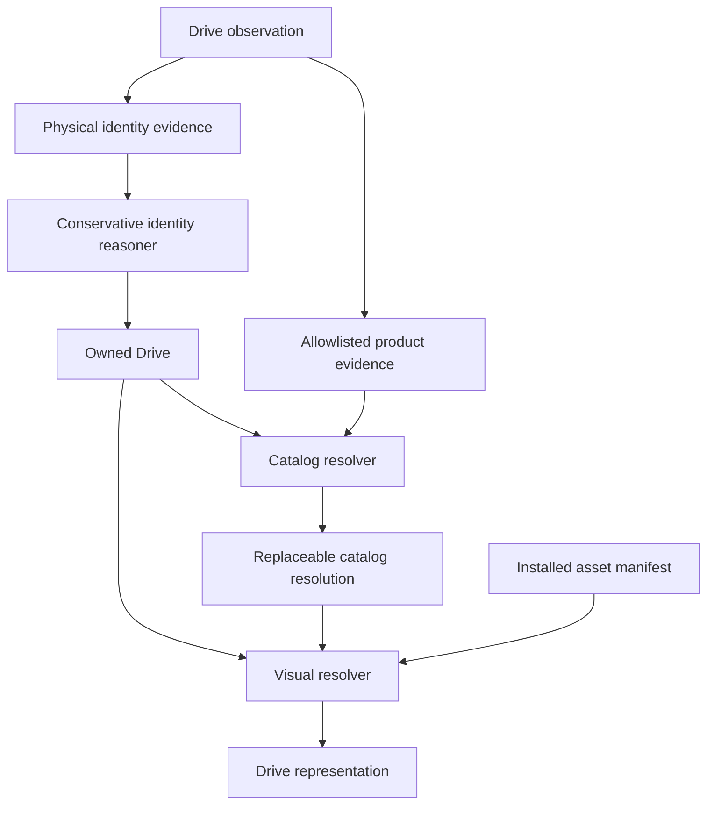

# Drive catalog and hardware representation

> **Related.** `2026-09-13-physical-drives.md` establishes the owned physical
> object beneath a volume and concludes its identity from observations. This
> plan adds a separate product catalog and visual system. Physical identity
> answers "is this the same object?" The catalog answers "what product does it
> appear to be?"
>
> `2026-07-29-install-size.md` is also binding. A hardware view is not permission
> to put an unbounded mesh library in every Spacedrive binary.

## The decision

Create `packages/drives`, named `@sd/drives` in the Bun workspace.

The package owns the hardware product source data, archetype definitions,
approved runtime assets, preview renders, generated manifests, validation tools,
and renderer adapters. All approved drive assets live under this package, but
that does not mean every asset ships in every application.

The package does not own a person's drives. `Drive`, `DriveObservation`,
`DriveGroup`, physical identity reasoning, health history, labels, and locations
remain in core. The package must never receive a serial, WWN, GPT GUID, SMART
history, device UUID, path, or location to do its normal work.

This split gives the feature one contribution surface without putting UI bytes
or probabilistic product knowledge into the conservative identity system.

## Why a package

The visual system is larger than a screen component and smaller than an app. It
has several consumers:

- the React interface needs GLB loading, materials, camera behavior, and poster
  fallbacks;
- the GPUI applications need the same catalog and asset IDs, even while they
  initially render posters instead of live scenes;
- the daemon and CLI need product resolution without any rendering dependency;
- catalog contributors need schemas and validation without learning core;
- the asset pipeline needs reproducible inputs, validation, previews, and
  approval state.

Putting this in `@sd/assets` would lose that boundary. That package's generated
barrels statically import broad asset classes. The install-size plan records the
cost of doing so. Drive meshes need explicit manifests, release packs, and size
gates from the first asset.

`drives` is the product-area name. The catalog may describe enclosures,
adapters, docks, and chassis as well as media, but all are there to explain what
the drives view is showing.

## Package shape

The source tree should begin as:

```text
packages/drives/
    package.json
    README.md

    schema/
        manufacturer.schema.json
        product-line.schema.json
        product-variant.schema.json
        alias.schema.json
        asset.schema.json
        provenance.schema.json

    catalog/
        manufacturers/
        product-lines/
        variants/
        aliases/

    archetypes/
        bare-media/
        enclosures/

    assets/
        archetypes/<asset-id>/
            lod0.glb
            lod1.glb
            lod2.glb
            preview.webp
            asset.json
        products/<asset-id>/
            lod0.glb
            lod1.glb
            lod2.glb
            preview.webp
            asset.json

    provenance/
        sources/
        generation/

    packets/
        <product-id>/packet.json

    scripts/
        compile
        validate
        preview

    src/
        index.ts
        manifest.ts
        loader.ts
        react/

    generated/
        hardware-products.db
        assets.json
        core-assets.json
```

The stable catalog and asset contracts belong in the package README and schema
files. This plan owns phase order and acceptance criteria.

The root `@sd/drives` export stays renderer-neutral. React Three Fiber code is
behind `@sd/drives/react` and is loaded only by a surface that needs live 3D.
Backend-facing types come from generated `@sd/ts-client` types. The package must
not redefine `Drive`, `StorageFormFactor`, catalog resolution, or operation
outputs in TypeScript.

Start in this repository so the first schema, resolver, renderer, and release
budget change together. Keep the source and compiler free of Spacedrive core
internals so the community catalog can later move to its own repository. After
such a split, `@sd/drives` can consume a versioned compiled release without
changing runtime IDs or making the drives view depend on the network.

H1 also adds a small Rust crate named `sd-drive-catalog` to read the compiled
artifact. It owns matching and the read-only artifact loader, not physical
identity and not mesh bytes. Keep the Cargo crate under
`crates/drive-catalog`; do not turn one directory into both a Cargo package and
a Bun package.

## Four kinds of state

The system has four state classes with different truth and durability rules.

| State                                      | Owner                | Rule                                                         |
| ------------------------------------------ | -------------------- | ------------------------------------------------------------ |
| Product source and approved assets         | `@sd/drives`         | Canonical, reviewed, versioned with the package              |
| `hardware-products.db` and asset manifests | package compiler     | Derived, deterministic, replaceable                          |
| Automatic catalog resolution               | local resolver cache | Derived from observations plus catalog and resolver versions |
| A person's product correction              | library state        | Durable user assertion, never erased by a catalog rebuild    |

Physical drive identity is a fifth class owned entirely by the physical-drive
plan. No catalog table has a foreign key that can merge, split, or otherwise
decide a `Drive`.

Do not name the compiled product artifact `catalog.db`. That name already means
the derived cross-source content and placement projection throughout the source
convergence plans. `hardware-products.db` is unambiguous.

The hardware product database is an application resource. It is not a
Spacedrive `Source`, a source store, a record-table generation, or a part of
`library.db`.

## The identity firewall

One observation may feed both systems, but through different projections:



The catalog resolver runs after a physical drive has been concluded when it is
resolving the media. It can also resolve an observation-scoped bridge or
enclosure component. It receives only the already-concluded subject key for
correlation and never proposes another drive as the subject. The identity
reasoner never imports catalog matches, manufacturer families, asset IDs, or
catalog scores.

A wrong catalog conclusion may change a label or visual and then be replaced. A
wrong physical merge changes history. Their trust models must remain different
in code as well as prose.

## Observations must preserve product evidence

D0 currently records the strongest physical identifiers but not every key the
catalog will need. The observation window closes when hardware is unplugged, so
D0 must also preserve these raw product-level facts:

- a `StorageFormFactor` hint, separate from the existing machine-level
  `DeviceFormFactor`;
- ATA, SCSI, and NVMe vendor and model strings;
- NVMe vendor and subsystem identifiers where exposed;
- USB VID, PID, product revision, and product string;
- PCI vendor, device, subsystem vendor, and subsystem device IDs where exposed;
- which component a value describes: media, bridge, enclosure, or controller.

USB data must not be flattened into one alleged disk product. A useful
observation shape is conceptually:

```rust
pub struct ObservedHardwareComponent {
    pub role: HardwareComponentRole,
    pub vendor: Option<String>,
    pub model: Option<String>,
    pub firmware: Option<String>,
    pub identifiers: Vec<ProductIdentifier>,
    pub storage_form_factor: Option<StorageFormFactor>,
}

pub enum HardwareComponentRole {
    Media,
    Bridge,
    Enclosure,
    Controller,
}
```

The physical observation retains unit identifiers separately with their
provenance. The product-evidence projection is an allowlist and contains no unit
identifier. This preserves enough truth to recognize both a Samsung SSD and the
ORICO enclosure around it without allowing either conclusion to affect the
SSD's physical identity.

Network and cloud volumes do not manufacture physical `Drive` rows. Catalog
resolution begins with concluded physical media or an explicitly observed
hardware component, never with a source or volume alone.

## Product vocabulary

The catalog hierarchy is explicit:

```text
Manufacturer
    ProductLine
        ProductVariant
```

For example, Samsung is a manufacturer, T7 Shield is a product line, and a
specific capacity, color, and manufacturer part number is a variant. Seagate is
a manufacturer, Exos X20 is a product line, and `ST20000NM007D` identifies a
variant.

This avoids an ambiguous split between "model family" and "product family".
Capacity and SKU-specific dimensions belong to a variant when they differ.
Shared facts may be inherited from the product line during compilation, but the
compiled record contains the resolved value and its provenance.

The first product categories are bare drive, portable drive, enclosure,
multi-bay enclosure, flash drive, memory card, adapter, dock, and chassis.
Categories describe products. They do not imply ownership, containment, group
membership, or a volume relationship.

A source product record covers facts such as:

```rust
pub struct CatalogProductVariant {
    pub uuid: Uuid,
    pub manufacturer_uuid: Uuid,
    pub product_line_uuid: Uuid,
    pub name: String,
    pub category: ProductCategory,
    pub storage_form_factor: Option<StorageFormFactor>,
    pub dimensions_mm: Option<Dimensions>,
    pub mass_grams: Option<f32>,
    pub interfaces: Vec<Interface>,
    pub capacity_bytes: Option<u64>,
    pub aliases: Vec<CatalogAlias>,
    pub appearance: AppearanceDescriptor,
    pub claims: Vec<CatalogClaim>,
}
```

Stable UUIDs survive filename moves, renamed product lines, and source-tree
reorganization. Human-readable slugs aid contribution but do not become durable
identity. A removed or merged product retains redirects so a recorded human
override still resolves.

Aliases are typed data, not an array of loose strings. Each alias records its
match mode, normalized value or anchored expression, manufacturer scope,
priority, supported variants, and source. Exact model numbers and USB VID:PID
pairs must not share one untyped namespace.

Catalog facts never overwrite observations. Advertised interface speed is a
product fact. Measured transfer speed is a fact about a person's drive and its
path. Catalog capacity may reject an impossible match, but observed capacity
remains the displayed and identity-bearing value.

## Provenance is attached to claims

A flat list of URLs on a product is not enough when two sources disagree. Source
data should retain which claim each source supports:

```rust
pub struct CatalogClaim {
    pub field: CatalogField,
    pub source_id: SourceId,
    pub value: CatalogValue,
    pub retrieved_at: DateTime<Utc>,
}
```

The compiler chooses the effective value with a documented source order, such
as manufacturer mechanical drawing before manufacturer marketing page before a
retailer listing. It retains losing claims for review rather than flattening
them out of existence.

Every source record includes its URL, retrieval time, content digest, source
kind, redistribution status, and notes. References may be used locally without
being committed or shipped. Manufacturer photos, PDFs, label artwork, and
generation packets enter the repository only when their redistribution terms
permit it.

Generated trade dress is not automatically free of rights or source
restrictions. Exact labels, logos, and recognizable product designs receive the
same review as source images.

The smartmontools
[`drivedb.h`](https://github.com/smartmontools/smartmontools/blob/main/drivedb/drivedb.h)
is useful upstream knowledge, but the current file is marked
`GPL-2.0-or-later`. H3 cannot copy it into an Apache-2.0 package by default.
Import, build-time transformation, separate distribution, and clean
reimplementation each need an explicit licensing decision before code lands.

## Resolution

Resolution is deterministic for one catalog and resolver version. It proceeds
from specific typed evidence toward fallback:

1. Match exact manufacturer part numbers and typed device identifiers.
2. Match an exact normalized model alias within manufacturer scope.
3. Match an anchored product-line expression within manufacturer scope.
4. Resolve a known USB or PCI product for the component that reported it.
5. Use manufacturer and standard form factor for a visual family only.
6. Use the standard form factor archetype.
7. Use a nominal generic storage representation.

Normalization preserves the original value, strips transport padding and NULs,
collapses whitespace, normalizes case for comparison, and applies versioned
vendor aliases. It must not erase a suffix until the catalog has declared that
suffix non-distinguishing.

Capacity, interface, and form factor are constraints. A contradiction rejects a
candidate. Shared capacity alone never selects one product. Ambiguous top
candidates produce an unresolved result with candidates for diagnostics, not
whichever record sorted first.

USB VID:PID evidence normally describes the bridge or enclosure. It may describe
an integrated portable product when the catalog explicitly says so. It must
never silently become proof of the media inside an arbitrary enclosure.

Captured D0 strings form a permanent resolver regression corpus. Every new alias
adds positive, near-miss, ambiguity, and contradiction cases. Regexes are
anchored and bounded by manufacturer scope.

## Match quality is not visual quality

The original proposal used one confidence enum for two different questions.
They must stay separate.

```rust
pub struct CatalogResolution {
    pub subject: CatalogSubject,
    pub variant_uuid: Option<Uuid>,
    pub product_line_uuid: Option<Uuid>,
    pub match_level: CatalogMatchLevel,
    pub confidence: CatalogConfidence,
    pub evidence: Vec<CatalogMatchEvidence>,
    pub catalog_version: String,
    pub resolver_version: String,
}

pub enum CatalogSubject {
    DriveMedia(Uuid),
    ObservedComponent {
        observation_uuid: Uuid,
        role: HardwareComponentRole,
    },
}

pub enum VisualTier {
    ExactProduct,
    ProductLine,
    ManufacturerArchetype,
    StorageFormFactor,
    Generic,
}

pub enum ScaleBasis {
    ProductDimensions,
    StandardFormFactor,
    Nominal,
}
```

An exact variant match may still render a form-factor archetype because its
exact asset pack is absent. A generic visual has no `variant_uuid`. Physical
scale is authoritative only with product dimensions or a standardized form
factor; generic dimensions are marked nominal.

Automatic resolutions are cached with catalog and resolver versions and may be
recomputed. They are not cross-database foreign keys from `library.db` into a
shipped resource.

A person's manual product selection is a separate durable assertion. It records
the selected stable catalog target and target kind, the evidence available at
the time, and normal sync ordering fields when drive state becomes synced.
Catalog updates may warn that an override now redirects or conflicts, but they
do not erase it.

## A product is not necessarily the drive

A media product and the hardware around it are separate catalog subjects. A
Samsung 990 Pro observed through an ORICO enclosure may yield:

```text
DriveMedia(drive_uuid)                         -> Samsung 990 Pro 4 TB
ObservedComponent(observation_uuid, Enclosure) -> ORICO USB4 enclosure
```

The enclosure match is observation-scoped until Spacedrive has a first-class
owned-hardware or containment model. Moving the SSD through a second enclosure
does not replace the first observation or change the drive's identity.

`DriveGroup` is logical storage topology, not a chassis. A ZFS pool can span two
enclosures, and one enclosure can hold unrelated media. H5 may render a group
inside a chassis only after a physical containment and bay model establishes
that relationship.

The same rule applies to location. `Drive.location: Option<String>` can label a
place, but it cannot produce a reliable shelf, crate, and slot hierarchy. A
spatial location view needs a later structured-location model.

## Asset identity and visual resolution

Code asks for a representation through stable IDs, never repository filenames.
Each approved asset has:

- a stable `AssetId` that survives content replacement;
- a digest for cache and pack integrity;
- the product, line, or archetype it depicts;
- LOD and poster references;
- physical dimensions and scale basis;
- material and node inventory;
- license, source, generator, and approval provenance.

The installed-asset manifest participates in resolution:

```text
exact product asset installed
    product-line asset installed
        manufacturer archetype installed
            parametric form-factor asset installed
                generic core asset
```

The resolver returns the best available representation. A catalog update, asset
pack install, or improved model changes the result without migrating a person's
drive row.

## Asset contract

Approved hardware models use GLB with
[`glTF 2.0`](https://registry.khronos.org/glTF/specs/2.0/glTF-2.0.html). The
contract follows glTF rather than inventing a second interpretation:

```text
Format:             GLB, glTF 2.0
Coordinate system:  right-handed, Y-up
Linear units:       metres in the GLB
Catalog dimensions: millimetres in source data and APIs
Origin:             physical bounding-box center
Orientation:        connector side faces -Z, presentation front faces +Z
Geometry:           closed production mesh, applied transforms, real proportions
Materials:          PBR, named semantic slots
Textures:           2K maximum by default, no external URIs
LOD0:               at most 50k triangles
LOD1:               at most 10k triangles
LOD2:               at most 2k triangles
Poster:             WebP on a standard transparent scene
```

The package stores LODs as separate GLBs. `MSFT_lod` is a vendor extension and
cannot be the only way a client finds lower-detail geometry. Separate files also
let dense views fetch only LOD2.

Required material slots begin with `shell`, `label`, `pcb`, `connector`, and
`led` where applicable. Archetypes may omit irrelevant slots. Tiny manufacturing
details are baked or omitted; silhouette, dimensions, connectors, and edge
treatment carry recognition at interface scale.

The validator checks:

- [Khronos glTF Validator](https://github.com/KhronosGroup/glTF-Validator)
  validity and absence of forbidden external resources;
- bounding-box dimensions against the declared tolerance;
- origin and connector orientation;
- finite transforms, normals, and manifold or intentionally marked open parts;
- required node and material names;
- triangle, texture dimension, texture byte, and total file budgets;
- all required LODs and the poster;
- manifest references, content digests, provenance, and approval state;
- deterministic compilation of the package outputs.

The exact byte budgets are recorded in a versioned `budgets.json` during H0,
after measuring the first archetypes in Tauri and `sd-server`. H0 does not close
without a CI size gate.

## Parametric archetypes

The source definitions are parametric even when the release output is compiled
GLB. That keeps geometry renderer-neutral and makes standard variants
reproducible.

The initial bare-media set is:

- 3.5-inch HDD;
- 2.5-inch HDD and SATA SSD;
- M.2 2230, 2242, 2260, 2280, and 22110;
- mSATA;
- U.2/U.3;
- E1.S, E1.L, E3.S, and E3.L;
- PCIe add-in card;
- SD, microSD, and CFexpress;
- USB flash drive.

The initial enclosure set is:

- 2.5-inch portable HDD and portable SSD;
- desktop external HDD;
- single M.2, 2.5-inch, and 3.5-inch enclosure;
- dual-drive, four-bay, and eight-bay enclosure;
- NAS chassis, drive dock, and card reader.

Standard variants are generated from dimensions, connector choice, materials,
and a small layout description. Exact product meshes are an enhancement over
these assets, not a prerequisite for a useful view.

## Rendering

The React renderer can build on the Three.js, React Three Fiber, and Drei stack
already in `@sd/interface`. It adds a GLB path rather than extending the current
PLY preview code into a drive-specific component.

`@sd/drives/react` owns the scene primitive, model loading, semantic materials,
camera fitting, turntable behavior, reduced-motion behavior, selection
highlight, and loading fallback. The drives route owns layout, queries,
selection, labels, health, and actions.

A gallery uses one shared canvas and scene, not one WebGL context per card.
Dense lists and initial loads use `preview.webp`. GPUI and clients without a 3D
renderer use the same poster manifest until they gain a GLB scene path. This is
a supported representation, not an error screen.

There are two scale modes:

- cards fit each object to its own frame for recognition;
- comparison, group, and containment views use one world scale so relative size
  remains honest.

Only the second mode communicates physical scale. A nominal generic object is
visually marked or excluded from exact comparisons.

## Distribution

Package ownership and release inclusion are separate decisions.

| Release consumer               | Included material                                                         |
| ------------------------------ | ------------------------------------------------------------------------- |
| Daemon and headless CLI        | `hardware-products.db`, resolver metadata, no mesh bytes                  |
| React, GPUI, and other UI apps | core archetypes, posters, asset manifest                                  |
| Core exact pack                | only approved high-value product assets within the checked budget         |
| Optional exact packs           | versioned and content-addressed assets resolved through an asset provider |
| Maintainer tooling             | source catalog, schemas, generation metadata, permitted references        |

Dynamic imports reduce startup and memory cost but do not reduce install size
when Vite still emits every referenced GLB. Release manifests decide which files
enter an application build. Optional packs are not statically imported by the
web bundle.

The always-local core pack guarantees a representation with no network. Missing
or corrupt optional packs fall back immediately. Exact assets never block the
drives list or catalog metadata.

Mesh bytes are not embedded in `sd-core`. Tauri resources, the web distribution,
and native app resources all consume the same generated release manifest. Pack
digests are verified before use.

## Astra generation and approval

An eligible product produces a standardized packet manifest containing the
known dimensions, approved source references, reference hashes, desired asset
ID, and asset contract version. Local source files may include front, rear, top,
and side images and a mechanical drawing when their terms permit use.

Astra is one producer, not a required part of the asset contract. A manually
authored Blender scene enters the same validation and review path. Its record
names the authoring tool and version, retains the editable source, and keeps that
source out of runtime release manifests.

Astra may infer unseen geometry for the asset. It may not add inferred values to
the catalog. Catalog dimensions constrain the model; an invented underside is
asset provenance, not a product fact.

Generation records retain:

- generator and version;
- exact prompt and asset contract version;
- source product UUID and source-file digests;
- generation time and output digest;
- validator report and preview renders;
- reviewer, decision, and review time.

Generated output enters `assets/` only after automated validation and human
approval. Failed and unapproved outputs remain pipeline artifacts and cannot be
resolved by a release manifest.

## Privacy boundary

Community export uses a new allowlisted type. It is not an observation serialized
and then redacted.

Allowed fields are product-level vendor and model strings, capacity class,
firmware family when useful, transport class, form factor, USB VID:PID, PCI IDs,
and other model-level standards identifiers.

The type cannot represent serials, WWNs, GPT GUIDs, filesystem or pool UUIDs,
SMART history, device UUIDs, timestamps, host names, paths, labels, notes,
locations, or photo EXIF. Tests build maximally populated private observations
and prove none of those values occur in the export.

## Phases

### H0: Package and archetypes

1. Create `@sd/drives` with renderer-neutral root exports and a lazy React
   renderer export.
2. Define `StorageFormFactor` and product-evidence component roles in Rust and
   generate their TypeScript types. Define asset IDs, the GLB contract,
   manifests, and `budgets.json` in the package.
3. Amend D0 observations to retain scoped product identifiers and form-factor
   evidence without exposing unit identifiers to the package.
4. Implement deterministic asset validation, compilation, poster generation,
   and the core release manifest.
5. Build the bare-media archetypes, then the enclosure archetypes needed by the
   first screen.
6. Add a shared-canvas React gallery with GLB and poster paths.
7. Map `StorageFormFactor` to archetype parameters and scale basis.

H0 can develop against fixtures immediately. Live integration waits for D1 to
produce concluded drives. It is complete when every test drive renders offline,
comparison mode preserves measured relative scale, a no-WebGL path shows
posters, and CI enforces validity and installed-byte budgets.

### H1: Product catalog

1. Add manufacturer, product-line, variant, alias, claim, and source schemas.
2. Compile them deterministically into `hardware-products.db` and runtime
   manifests.
3. Add `sd-drive-catalog` as the renderer-free Rust loader and resolver.
4. Add exact, normalized, expression, typed-ID, contradiction, and ambiguity
   resolution with a captured D0 regression corpus.
5. Add daemon operations that return generated catalog-resolution and visual
   descriptor types.
6. Cache automatic resolutions by evidence digest, catalog version, and resolver
   version.
7. Add a separate durable manual product override.
8. Resolve media and observation-scoped enclosure subjects independently.

H1 is complete when `ST20000NM007D-3DJ103` resolves to the supported Seagate
product line and variant, an ambiguous same-capacity device stays unresolved,
an enclosure VID:PID cannot identify the media inside it, and no catalog result
can change physical clustering.

### H2: Exact visuals

1. Select 20 to 30 recognizable products using observed frequency and visual
   recognition value.
2. Collect rights-reviewed dimensions and references.
3. Produce standardized generation or authoring packets and retain prompts,
   editable sources, and source digests.
4. Generate LODs and posters, validate them, and require human approval.
5. Add exact-product and product-line asset resolution through the installed
   manifest.
6. Admit assets to the core pack only while its size budget passes.

The first candidates are Samsung T7, T7 Shield, and T9; SanDisk Extreme
Portable; Crucial X-series portable SSDs; WD My Passport and Elements; Seagate
Expansion and Backup Plus; LaCie Rugged; common ORICO and Sabrent NVMe
enclosures; and common multi-bay DAS products. Bare-drive families favor labels
and shared geometry over bespoke meshes.

H2 is complete when an exact catalog match can independently fall back through
product line and form factor, approved assets are reproducible from provenance,
and an unapproved asset is impossible to ship.

### H3: Upstream knowledge

1. Establish import and redistribution rules per upstream source before adding
   an importer.
2. Adapt permitted model-family knowledge and USB bridge data.
3. Add USB, PCI, NVMe, and standardized form-factor registries.
4. Add manufacturer facts where source and redistribution terms permit them.
5. Keep upstream version, field provenance, and removal behavior in compiled
   records.

H3 is complete when every imported field can name its upstream version and
source, an upstream removal cannot silently erase a manual correction, and the
Apache release contains no unapproved GPL-derived dataset.

### H4: Community catalog

1. Add `hardware inspect` using the allowlisted public fingerprint type.
2. Define a small contribution bundle with product facts, source links, optional
   permitted references, and local validation output.
3. Add unknown-product submission and maintainer triage.
4. Queue products with enough approved references for asset generation.
5. Add asset review tooling and package-release checks.

H4 depends on H1's stable schema and compiler, D0's scoped evidence, D2's human
correction path, and H2's asset approval pipeline. It is complete when a private
observation cannot leak through export and a contributor can add a product
without editing Spacedrive core.

### H5: Rich physical UI

1. Show drive health, capacity, interface, and connector overlays.
2. Render `DriveGroup` topology without pretending it is physical containment.
3. Add a containment and bay model, then render real enclosure membership and
   exploded views.
4. Add structured physical locations before shelf, crate, and slot views.
5. Add consistent-scale comparison and transfer-path animation.

H5 depends on D3 and D4 for honest topology and surfaced drive state. Enclosure
slots and spatial locations have their own data prerequisites and do not get
inferred from catalog appearance.

## Order with physical drives

| Physical-drive plan                                   | Catalog plan                                                      |
| ----------------------------------------------------- | ----------------------------------------------------------------- |
| D0 captures raw identity plus scoped product evidence | H0 builds against fixtures and defines archetypes                 |
| D1 concludes drives                                   | H0 binds visuals to real drives; H1 resolves products             |
| D2 records human drive decisions                      | H1 records separate human product overrides; H2 adds exact assets |
| D3 establishes logical groups                         | H3 grows upstream knowledge                                       |
| D4 surfaces drive state                               | H4 grows community data; H5 builds rich views                     |

The observation additions land with D0 because they cannot be recovered after a
drive is boxed. Product interpretation can wait and be rewritten.

## What this is not

- It is not physical identity. Catalog evidence never merges or splits drives.
- It is not a second content catalog or a source store.
- It is not a claim that a USB product string names the media behind a bridge.
- It is not a claim that a storage group is an enclosure.
- It is not permission to ship every source image or generated mesh.
- It is not a network dependency. The core archetypes and posters work offline.
- It is not a plan to CAD-model the market. Parametric archetypes are the
  baseline and exact assets are selected enhancements.
- It is not permission to publish unit identifiers.

The physical-drive plan gives a storage object a biography. This package gives
the interface an honest, progressively improving way to depict the product,
without weakening the system that decides which physical object it is.
