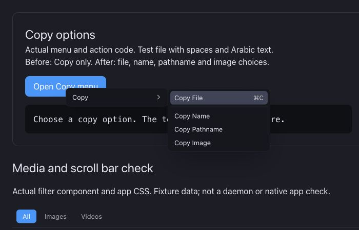

# Copy options

The file context menu had one Copy action. It stored a file operation inside Spacedrive. It could not copy a file name, pathname, or image pixels into another app.

Copy now opens a submenu. Copy File keeps the existing action and shortcut. Copy Name keeps the extension. Copy Pathname copies the physical path. Multiple selections use one line per name or path. A selection with an unresolved content path disables pathname copy instead of writing a partial list. Copy Image is available for one local PNG or JPEG file.

Native writes reuse the official Tauri clipboard-manager plugin already present in the Rust app. Its JavaScript package is pinned to the same 2.3.2 release. The package has MIT OR Apache-2.0 terms. It writes locally and sends no data to a service. The existing image crate supplies the PNG/JPEG decoders. No new clipboard parser or native clipboard implementation is needed. Image copy requires the Tauri image feature and write-image capability. Other image formats and remote image reads remain unsupported.

Text or image copy clears a held file operation only after the system clipboard write succeeds. An error retains the pending operation and shows a message.

This screenshot shows the actual web menu renderer and shared copy action code with a test file. It proves that all four choices are visible. It does not prove native image clipboard transfer.

Checks: seven focused Bun tests passed. They cover spaces and Arabic text, extensions, multiple selections, image callback routing, unavailable image actions, mixed path selections, clipboard failure, and the original file action. The isolated app TypeScript check passed. The local browser action displayed the exact test pathname. The combined frontend production build, macOS release desktop build, and installed app signature check passed. The updated native app starts and its background daemon continues processing. Native context-menu interaction could not be completed: macOS capture returns a Stage Manager thumbnail, and AX right-click does not open the menu. Native image clipboard transfer and Windows/Linux runtime remain unverified.
