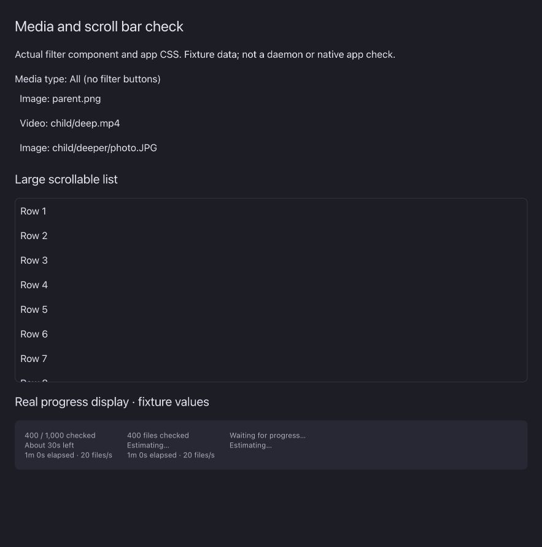
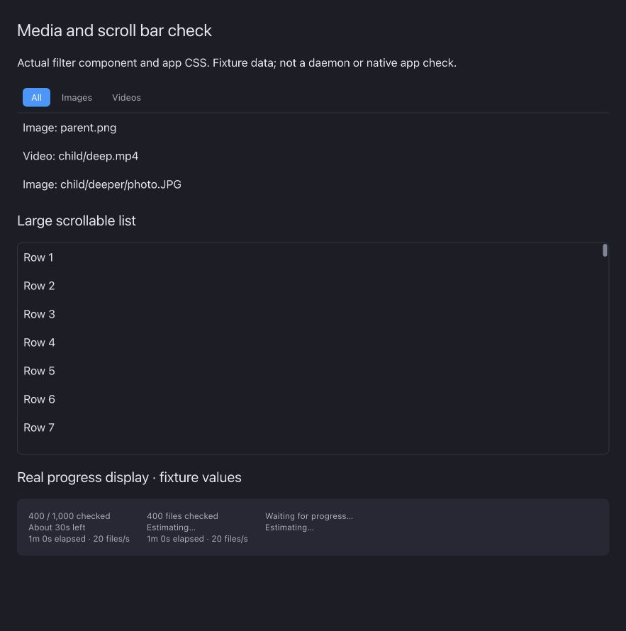

# media-type-filter verification

The preview uses the actual filter component and app scroll bar CSS with fixture data. It is not a native app screenshot. The unrelated progress panel uses fixture values and is outside this PR. The production frontend build passed. Full native window and virtual gallery layout checks remain.
