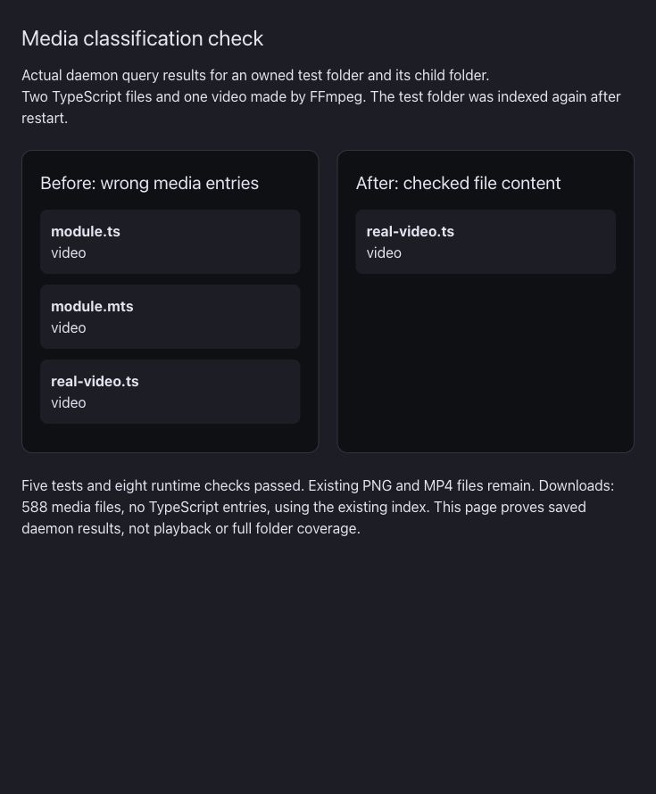

# TypeScript in the media gallery

The extension registry assigned MPEG transport streams a higher priority than TypeScript. Both use `.ts` and `.mts`. The fast index therefore labelled source files as video. The old magic patterns also accepted a single `G` byte at the start or near the start of a source file.

The fast path now leaves these two ambiguous suffixes unknown. Folder media listing checks their file content, including entries from old snapshots. It uses the existing file-type registry after releasing the arena lock, with at most 16 checks at once. It filters by the verified kind before sorting, counting and limiting. An unreadable or remote ambiguous file is excluded rather than given a guessed video kind. An image-only query does not read unknown TypeScript candidates.

The existing declarative magic-pattern matcher checks three sync bytes at transport packet boundaries. The definitions cover 188-byte TS, 192-byte timestamp-prefixed streams, and 204-byte streams. These lengths and sync bytes match the public FFmpeg definitions: https://ffmpeg.org/doxygen/trunk/mpegts_8h.html . This reuses Spacedrive's existing matcher and does not add a parser or dependency. FFmpeg is used only to make the test video; no FFmpeg source was copied.

The runtime test folder holds `module.ts`, a nested `module.mts`, and a nested `real-video.ts` made with FFmpeg. The old daemon returns all three as video. The repaired daemon returns only the real video. The test folder was indexed again after restart because its earlier manual scan was temporary. The comparison does not prove reuse of the same fixture snapshot.

Five release-profile registry/query tests passed, including the existing registry check. They cover uppercase suffixes, empty source files, source text starting with `G`, three transport packet layouts, and a missing-file read. `cargo fmt --all --check` passed. The release daemon build, installation, and installed app signature check passed. Eight runtime checks passed: All, Videos, Images, direct children only, existing media in All/Images/Videos, and a one-item limit. Existing PNG and MP4 files remain. Downloads returns 588 media files and zero `.ts`/`.mts` source entries from the existing user index, without a Downloads rescan. This check covers folder media listing. It does not repair stored kinds across all source, collection or search APIs. Remote ambiguous files and truncated streams with fewer than three packet boundaries remain unverified.

This screenshot shows captured daemon results from the owned test folder. It proves the returned media entries. It does not prove native playback or all-folder coverage. The installed native Downloads gallery also finishes loading and shows image/video entries. Native playback, full source/collection/search behavior, and all-folder coverage remain unverified.
