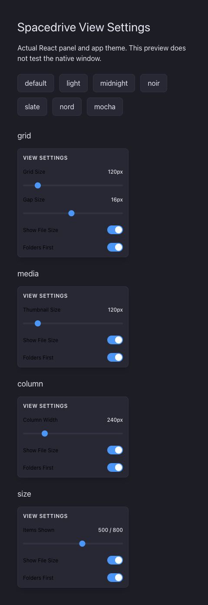
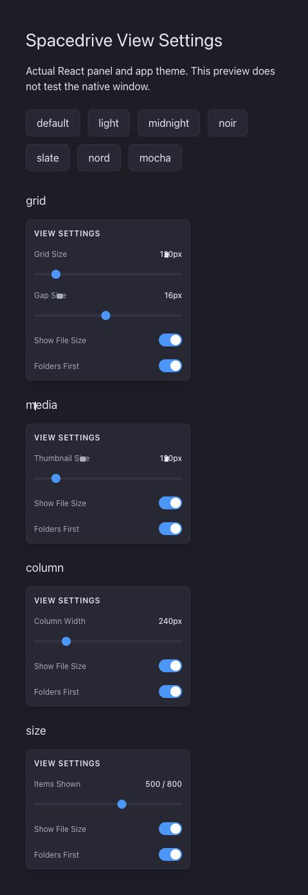
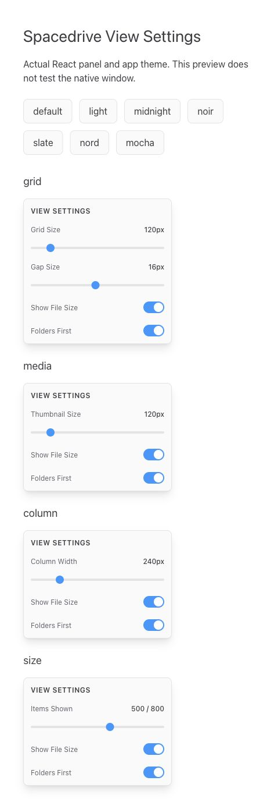

# View Settings contrast check

The before image uses the panel from main at f69c1fe. The after images use the panel from e0a556f. Both use the app CSS and an isolated React preview with local settings state, not a native app window.

Four views were checked in seven themes. The saved label and background colours have contrast ratios above 4.5:1. Five sliders reached their minimum and maximum values. Eight switches changed state and returned to their initial state. The desktop frontend production build passed. Details are in [checks.json](checks.json).

These checks cover the panel colours and controls in the preview. Native screen capture was unavailable. No claim is made about daemon, indexing, or full app stability.
